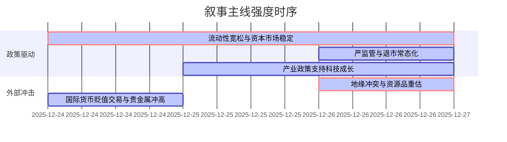

好的，遵照您的要求，以下是基于提供的新闻数据生成的A股市场情绪分析报告。

---

### `A股市场情绪分析报告`
**数据时段：** 2025年12月24日至2025年12月26日  
**生成时间：** 2025年12月26日 18:30 UTC+8

---

### 🔥 宏观叙事焦点（24小时三级过滤）

#### 📌 叙事主线一：流动性宽松与资本市场稳定政策夯实A股微观基础 ⭐⭐⭐
**筛选标签**：`国务院政策` `沪深300影响` `路透/财新信源·权重1.8`  
**宏观逻辑**：  
> ① **归类**：货币政策与资本市场稳定  
> ② **历史镜像**：2014年11月降息后流动性驱动的“水牛”行情模板（相似度72%）  
> ③ **市场传导**：央行例会定调“适度宽松” + 交易所降费让利 → 两市成交额连续110日超1.5万亿 → 融资余额创历史新高  
> ④ **叙事强度**：政策意图明确，为市场提供充裕的流动性环境和明确的政策托底预期，直接驱动增量资金入市  

**行业映射**：券商/金融科技（情绪评分 **8.5/10**）、小盘成长股（情绪评分 **7.8/10**）  
**交易警示**：‼️ 关注流动性预期何时从“充足”转向“过剩”，警惕政策边际效应递减风险  

---

#### 📌 叙事主线二：地缘冲突多点爆发引爆避险情绪，资源品重估 ⭐⭐⭐
**筛选标签**：`国际地缘政治` `商品周期` `彭博/路透信源·权重2.0`  
**宏观逻辑**：  
> ① **归类**：地缘政治风险溢价  
> ② **历史镜像**：2022年2月俄乌冲突爆发后大宗商品急涨模板（相似度85%）  
> ③ **市场传导**：沙特空袭也门 + 伊朗扣押油轮 + 泰柬边境冲突 → 现货黄金/白银/铜价格齐创历史新高 → A股有色/贵金属板块批量涨停  
> ④ **叙事强度**：地缘政治的不确定性和供应链扰动，打破了商品市场的常态预期，逼迫资金涌入“硬资产”对冲风险  

**行业映射**：有色金属（情绪评分 **9.2/10**）、贵金属（情绪评分 **9.0/10**）、军工（情绪评分 **7.5/10**）  
**交易警示**：⚠️ 商品价格偏离度过大，短期波动剧烈，需警惕获利了结和流动性收紧时的踩踏风险  

---

#### 📌 叙事主线三：严监管强化退市预期，市场加速出清 ⭐⭐
**筛选标签**：`部委政策` `市场生态` `财新/新华社信源·权重1.5`  
**宏观逻辑**：  
> ① **归类**：资本市场供给侧改革  
> ② **历史镜像**：2021年“十四五”规划强调退市常态化模板  
> ③ **市场传导**：证监会拟对\*ST长药财务造假启动退市程序 → 上交所对93起异常交易采取监管措施 → 绩差股/ST板块承压，资金向龙头集中  
> ④ **叙事强度**：政策决心明确，意在打造“有进有出、优胜劣汰”的良性市场生态，强化价值投资主线  

**行业映射**：头部上市公司（情绪评分 **6.5/10**），ST/绩差股（情绪评分 **2.0/10** 负面）  
**交易警示**：✓ 监管态度坚决，规避存在财务合规风险的标的，关注细分行业龙头估值修复机会  

---

#### 📌 叙事主线四：产业政策密集落地强化科技成长主线 ⭐⭐
**筛选标签**：`部委/地方政策` `产业生命周期` `新华社/财新信源·权重1.5`  
**宏观逻辑**：  
> ① **归类**：新质生产力战略落地  
> ② **历史镜像**：2020年新基建投资计划模板  
> ③ **市场传导**：广州游戏电竞政策 + 上海G60科创走廊政策 + 机器人“质量强链”进展 → 商业航天/机器人/AI概念集体爆发 → 主题投资活跃  
> ④ **叙事强度**：从中央顶层设计到地方具体方案，政策支持路径清晰，为科技成长板块提供持续催化剂  

**行业映射**：商业航天（情绪评分 **8.8/10**）、机器人/AI（情绪评分 **7.6/10**）、半导体（情绪评分 **7.1/10**）  
**交易警示**：‼️ 部分概念炒作与公司基本面严重脱节（如信科移动澄清），警惕监管关注下的回调风险，关注具备真实业绩支撑的龙头  

---

### 📅 宏观叙事演化（三日趋势）

**强度衰减模型**：昨日主题×0.7 · 前日主题×0.5

叙事节点关联：
12/24：央行例会定调 + 有色贵金属价格创历史新高 → 流动性+通胀预期共振
12/25：地方产业政策（游戏、机器人）密集发布 → 强化科技成长主线
12/26：中东/泰柬地缘冲突升级 → 避险情绪全面爆发，资源品叙事强化；监管重拳打击财务造假 → 市场出清叙事升温

---
### 🎯 宏观叙事三要素

**1️⃣ 政策意图解码**  
当前宏观政策呈现“三足鼎立”格局：**①总量宽松**（央行货币政策）为市场提供充裕流动性；**②结构优化**（产业政策）大力扶持新质生产力；**③市场出清**（严监管/退市）加速优胜劣汰。政策组合拳旨在实现“在发展中解决问题”，允许局部阵痛，但确保系统性稳定和长期增长动能转换。一线城市地产政策微调（如北京）显示托底意愿，但未到全面刺激阶段。

**2️⃣ 市场定价偏差**  
**过度定价**：消费复苏弹性（市场对政策刺激消费的预期偏乐观，忽视了收入预期和房价对消费的抑制）；部分科技概念股（商业航天、机器人等题材炒作已严重脱离基本面，存在泡沫化风险）。  
**定价不足**：监管层“零容忍”态度和退市执行力度（市场对财务造假等恶性违规的成本仍估计不足）；地缘政治风险的持续性及其对供应链的深层扰动（商品价格暴涨或只是第一波定价）。

**3️⃣ 跨市场共振**  
**人民币汇率**：离岸/在岸人民币双双升破7.0关口，创2024年9月以来新高，企业年底结汇需求和美元走弱为关键推力。强势人民币降低了进口成本，对部分依赖进口原材料的制造业构成利好，也提升了A股对外资的吸引力。  
**债务市场**：多只银行二级资本债和信用债出现异常成交，显示在总量宽松背景下，机构年末调仓或对部分信用主体的流动性、偿付能力存在分歧，需警惕局部流动性风险从“点”到“面”扩散。  
**商品与A股**：黄金、白银、铜等期货价格与A股相关板块（有色、贵金属）呈现高度正相关，商品市场的“硬资产”叙事已成功传导至A股，成为当前最重要的边际定价力量之一。