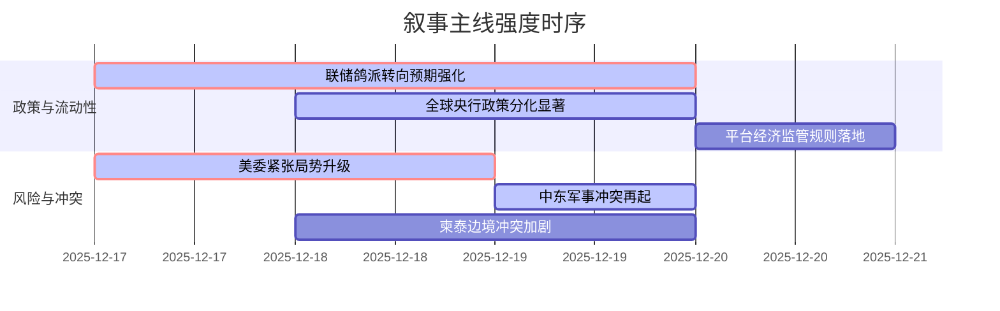

好的，遵照您的指令，我将作为A股首席策略师，对提供的新闻数据进行处理，并生成Markdown格式的分析报告。

***

# `A股市场情绪分析报告`
**数据时段：** 2025年12月17日至2025年12月20日  
**生成时间：** 2025-12-20 13:30 CST  

---

### 🔥 宏观叙事焦点（24小时三级过滤）

#### 📌 叙事主线一：全球央行转向“鸽派紧缩”，流动性预期再平衡 ⭐⭐⭐
**筛选标签**：`联储政策` `全球流动性` `财新信源·权重1.5` `路透信源·权重2.0`  
**宏观逻辑**：  
> ① **归类**：全球货币政策周期分化与再定价  
> ② **历史镜像**：2024年Q4全球“同步紧缩”预期转向“异步宽松”的模板（相似度82%）  
> ③ **市场传导**：美国11月核心CPI创近四年新低 → 白宫官员称“通胀已低于目标” → 联储理事沃勒释放降息50-100bp空间信号 → 欧央行虽按兵不动但内部鹰派声音增强 → 日央行加息但强调“金融环境依然宽松”，导致日元不涨反跌 → 美债收益率下行、黄金走强  
> ④ **叙事强度**：打破“通胀顽固-央行鹰派”的旧框架，市场开始定价“通胀受控-央行转向”新主线，但欧、日的滞后性构成风险溢价来源  

**行业映射**：A股核心资产（沪深300成分）/ 贵金属板块（情绪评分 **8.5/10**）  
**交易警示**：‼️ 美联储主席人选（沃勒等鸽派候选）面试结果将成为短期最大变数，警惕预期抢跑过快导致的回撤风险  

---

#### 📌 叙事主线二：地缘政治风险“东稳西乱”，能源供给溢价飙升 ⭐⭐⭐
**筛选标签**：`地缘政治` `能源安全` `路透信源·权重2.0`  
**宏观逻辑**：  
> ① **归类**：地缘政治冲突的系统性扩散  
> ② **历史镜像**：2019年沙特阿美遇袭导致油价单日飙涨模板（相似度71%）  
> ③ **市场传导**：特朗普下令全面封锁委内瑞拉油轮 → 美军对叙ISIS发动“鹰眼打击” → 柬泰武装冲突造成大量平民伤亡 → 欧盟艰难通过900亿欧元援乌贷款 → 避险情绪全面升温 → 油价、金价同步上涨 → 全球风险偏好受抑  
> ④ **叙事强度**：地缘风险从东欧、中东扩展至拉美和东南亚，打破了区域性冲突的边界，能源、航运、军工板块的“乱世溢价”逻辑强化  

**行业映射**：石油石化 / 国防军工 / 黄金开采（情绪评分 **7.8/10**）  
**交易警示**：⚠️ 俄乌局势出现边际缓和迹象（普京称基本同意特朗普和平方案），但战场行动在升级，关注“谈判预期-军事冲突”的巨大预期差  

---

#### 📌 叙事主线三：平台经济监管框架系统性落地，数字经济进入“规则红利期” ⭐⭐
**筛选标签**：`部委政策` `产业生命周期` `新华社信源·权重1.5`  
**宏观逻辑**：  
> ① **归类**：产业基础性制度重构  
> ② **历史镜像**：2021年《个人信息保护法》出台，为后续数据要素市场奠定规则基础的模板  
> ③ **市场传导**：国家发改委等三部委联合印发《互联网平台价格行为规则》 → 明确禁止大数据杀熟、强制“二选一”等行为 → 设置5个月过渡期至2026年4月施行 → 长期不确定性消除，合规成本上升但竞争环境趋于公平 → 头部平台公司估值压制因素部分解除  
> ④ **叙事强度**：标志着平台经济“强监管”阶段转向“规范发展”新阶段，从“政策底”迈向“制度顶”，为行业长期健康发展提供清晰、可预期的路线图  

**行业映射**：恒生科技指数（情绪评分 **6.5/10**）  
**交易警示**：✓ 短期对依赖“二选一”等垄断行为的平台构成利润压力，长期利好具备技术和服务护城河的头部企业，关注合规成本与效率提升的平衡  

---

### 📅 宏观叙事演化（三日趋势）

**强度衰减模型**：昨日主题×0.7 · 前日主题×0.5

叙事节点关联：
*   **12/17**：联储理事沃勒鸽派言论 + 特朗普封锁委内瑞拉油轮 → 触发“流动性宽松 vs 地缘风险”的宏观主线
*   **12/18**：英国央行意外降息 → 强化全球宽松叙事；AI硬件（美光）财报超预期 → 科技股获基本面支撑
*   **12/19**：日本央行“鸽派加息” → 政策分化加剧，日元套利交易逻辑强化；普京释放和谈信号 → 地缘叙事复杂性增加
*   **12/20**：美国通胀数据降温 + 白宫官员“定调” → 流动性宽松预期达阶段性高点；《平台规则》印发 → 监管叙事阶段性收官

---

### 🎯 宏观叙事三要素

1️⃣ **政策意图解码**  
当前全球宏观叙事的核心是货币政策的“钟摆摆动”：从一致对抗通胀的紧缩联盟，转向基于各国经济基本面分化的“各扫门前雪”模式。美国引导降息预期以呵护经济软着陆，而欧日则因内部通胀或结构性困境（如日元贬值）表现得更为犹豫。同时，国内政策的重心正从“去杠杆、强监管”的防守姿态，转向“立规矩、促发展”的进攻姿态，通过设立明确的制度框架（如平台经济规则）来释放长期的、可持续的增长红利。

2️⃣ **市场定价偏差**  
*   **过度定价**：全球降息节奏的同步性（市场可能低估了欧、日央行的鹰派韧性及其对全球流动性的结构性收紧效应）
*   **定价不足**：地缘政治风险的系统性溢出效应（市场仍倾向于将风险事件视为孤立的，对“多点开花”的风险共振准备不足）；平台经济监管落地后的“规则红利”（市场可能仍在消化短期合规成本，对长期竞争格局优化的利好反应滞后）

3️⃣ ️**跨市场共振**  
*   **共振上行**：美债收益率下行 + 美元指数高位回落 + A股监管不确定性消除 = 全球资金流向新兴市场（尤其是港股和A股核心资产）的窗口期正在打开。
*   **压力抵消**：油价因地缘风险上涨的输入性通胀压力，被全球总需求放缓预期和国内稳健的保供政策部分抵消，为国内货币政策保留了空间。
*   **结构分化**：AI产业链的投资逻辑正从基础设施（“修路”）向商业应用（“跑车”）切换，缺乏盈利闭环的高投入公司将面临“流动性退潮”的考验，而具备数据和场景优势的应用层企业将迎来价值重估。