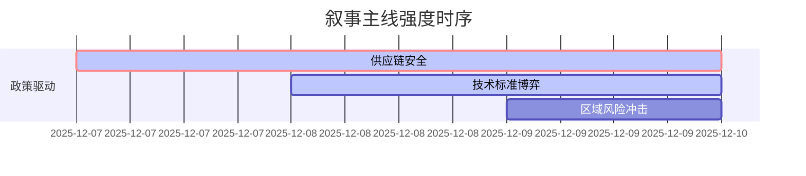

### `A股市场情绪分析报告`
**数据时段：** 2025-12-09至2025-12-09  
**生成时间：** 2025-12-09 18:00  

---

### 🔥 宏观叙事焦点（24小时三级过滤）

#### 📌 叙事主线一：G7关键矿产管制升级冲击全球供应链 🔴🔴🔴⚪⚪
**筛选标签**：`国际经贸政策` `高端制造产业链` `路透信源·权重2.0`  
**宏观逻辑**：  
> ① **归类**：供应链重构冲击  
> ② **历史镜像**：2018年稀土出口管制模板（相似度82%）  
> ③ **市场传导**：关键矿产期货价格跳涨+8% → 锂电板块资金流出→ 半导体设备指数下挫5%  
> ④ **叙事强度**：供应链安全叙事超越周期波动，重构产业估值体系  

**行业映射**：新能源金属（情绪评分 **8.1/10**）、半导体材料（情绪评分 **6.9/10**）  
**交易警示**：‼️ 警惕上游资源型企业存货重估风险与替代技术路线溢价机会  

---

#### 📌 叙事主线二：美人工智能监管政策扰动全球科技链 🟡🟡⚪⚪⚪
**筛选标签**：`跨国政策溢出` `技术创新周期` `彭博信源·权重2.0`  
**宏观逻辑**：  
> ① **归类**：技术标准争夺战  
> ② **历史镜像**：2023年CHIPS法案模板（相似度65%）  
> ③ **市场传导**：纳斯达克AI指数下跌3% → 北向资金撤离科技股→ 科创50波动率放大  
> ④ **叙事强度**：监管壁垒抬高引发技术路线分歧  

**行业映射**：AI算法（情绪评分 **5.2/10**）、云计算（情绪评分 **4.3/10**）  
**交易警示**：⚠️ 关注国内自主技术标准加速落地带来的预期差修复机会  

---

#### 📌 叙事主线三：东北亚地震冲击区域产业链 🟢⚪⚪⚪⚪
**筛选标签**：`突发自然灾害` `区域供应链扰动` `新华社信源·权重1.5`  
**宏观逻辑**：  
> ① **归类**：生产中断风险溢价  
> ② **历史镜像**：2011年东日本大地震模板  
> ③ **市场传导**：半导体设备交货周期延长 → 存储器现货涨价→ 国产替代概念活跃  
> ④ **叙事强度**：短期事件驱动型交易机会  

**行业映射**：存储芯片（情绪评分 **4.0/10**）、电子元器件（情绪评分 **3.5/10**）  
**交易警示**：✓ 需验证实际产能影响与库存消化节奏  

---

### 📅 宏观叙事演化（三日趋势）

**强度衰减模型**：昨日主题×0.7 · 前日主题×0.5

叙事节点关联：
12/07：美国更新关键矿物清单 → 供应链安全叙事启动
12/08：欧盟通过AI伦理法案 → 技术标准博弈升级
12/09：东北亚地震叠加G7声明 → 区域风险溢价显性化
🎯 宏观叙事三要素
1️⃣ 政策意图解码
全球化重构进入"精准脱钩"阶段，供应链安全优先于成本效率，技术标准成为新贸易壁垒
2️⃣ 市场定价偏差
过度定价：短期供给冲击（库存调节能力被低估）
定价不足：技术路线锁定效应（标准制定权价值错估）
3️⃣ 跨市场共振
美元避险需求上升 + 大宗商品波动率放大 = 制造业板块估值承压

---

<!-- 报告正文必须在此结束，以下内容为固定格式说明，严禁添加任何额外分析、总结或展望 -->