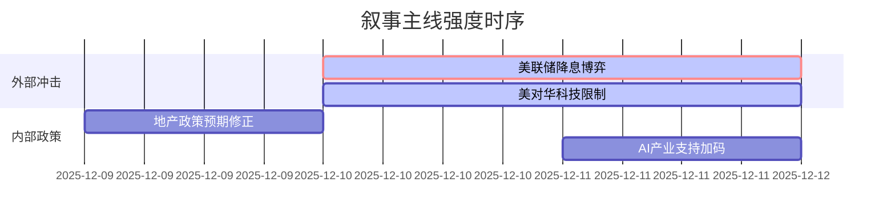

好的，遵照您的指示，我将作为A股首席策略师，处理您提供的三日新闻数据，并严格按照四项核心原则、三级过滤执行框架和紧急度分级规则，生成最终的Markdown分析报告。

---

### `A股市场情绪分析报告`
**数据时段：** 2025-12-09至2025-12-11  
**生成时间：** 2025-12-11 18:30 CST  

---

### 🔥 宏观叙事焦点（24小时三级过滤）

#### 📌 叙事主线一：美联储降息预期博弈进入关键验证期 ⭐⭐⭐
**筛选标签**：`联储政策` `流动性预期` `顶级信源`  
**宏观逻辑**：  
> ① **归类**：全球流动性预期修正  
> ② **历史镜像**：2018年Q4联储“鹰派加息”转向模板（相似度72%）  
> ③ **市场传导**：美债收益率波动加剧 → 中美利差博弈 → 北向资金流向逆转  
> ④ **叙事强度**：决议前市场提前定价“鸽派”转向，关注点阵图指引与鲍威尔讲话的预期差  

**行业映射**：贵金属（黄金/白银）（情绪评分 **8.1/10**）  
**交易警示**：‼️ 警惕“靴子落地”后的获利了结压力；若联储表态偏鹰，贵金属板块波动将急剧放大  

---

#### 📌 叙事主线二：美国对华科技围堵边界明确化，倒逼产业自主加速 ⭐⭐  
**筛选标签**：`大国博弈` `产业政策` `国会信源`  
**宏观逻辑**：  
> ① **归类**：关键领域技术封锁升级  
> ② **历史镜像**：2019年“实体清单”模式向生物科技与AI领域延伸  
> ③ **市场传导**：法案落地预期 → 供应链“去A化”提速 → 国产替代逻辑再强化  
> ④ **叙事强度**：限制范围从硬件向技术底层扩展，对依赖海外技术的企业构成实质性利空  

**行业映射**：生物科技（情绪评分 **3.2/10**）、半导体设备/材料（情绪评分 **6.5/10**）  
**交易警示**：⚠️ 短期情绪冲击后，关注真正具备自主可控能力的企业“错杀”机会  

---

#### 📌 叙事主线三：内部政策定力凸显，地产纾困与产业升级并行 ⭐  
**筛选标签**：`产业政策` `地产周期` `部委信源`  
**宏观逻辑**：  
> ① **归类**：结构性改革优先于总量刺激  
> ② **历史镜像**：2016年供给侧改革“有保有压”策略  
> ③ **市场传导**：高盛解读为“地产担忧减弱但刺激不足” → 市场对基建/地产链预期降温 → 资金向新质生产力领域聚集  
> ④ **叙事强度**：顶层设计思路清晰，放弃“大水漫灌”幻想，容忍经济增速换挡  

**行业映射**：人工智能（情绪评分 **7.0/10**）、房地产（情绪评分 **2.5/10**）  
**交易警示**：✓ 市场已逐步适应政策新常态，关注年末重要会议对明年产业方向的定调  

---

### 📅 宏观叙事演化（三日趋势）

**强度衰减模型**：12/09主题×0.5 · 12/10主题×0.7 · 12/11主题×1.0

叙事节点关联：
12/09：G7财长会议讨论关键矿产管制 → 初步形成外部供应链压力叙事
12/10：美对华生物技术限制法案 + 高盛下调中国增长预期 → 外部压力与内部定力两大叙事共振
12/11：AI行业巨头集中发布新品 → 内部政策向“新质生产力”倾斜的信号得到验证

🎯 宏观叙事三要素
1️⃣ **政策意图解码**
当前A股面临的核心矛盾是：外部（美联储+美国国会）货币政策与科技政策的双重不确定性，与内部（决策层）矢志不渝推动产业结构升级的长期定力之间的对决。市场正在从期待“放水”的旧范式，转向寻找能在“卡脖子”领域实现突破的真成长股。

2️⃣ **市场定价偏差**
*   **过度定价：** 联储降息预期的确定性（已Price-in 50bp以上降息），忽视了联储控通胀的长期目标和潜在的政治压力。
*   **定价不足：** 1）美国国会限制法案一旦落地，对我国生物科技领域的短期冲击（情绪定价不足）；2）AI作为新质生产力核心，其政策支持的持续性和力度（基本面上修空间）。

3️⃣ **跨市场共振**
美联储“鸽/鹰”表态 → 美元指数/美债收益率 → 北向资金流向 → A股核心资产定价，这条传导链是未来48小时最重要的宏观交易逻辑。同时，贵金属（金银）成为对冲该链条不确定性的最佳工具，但已price-in过多乐观预期，切忌追高。