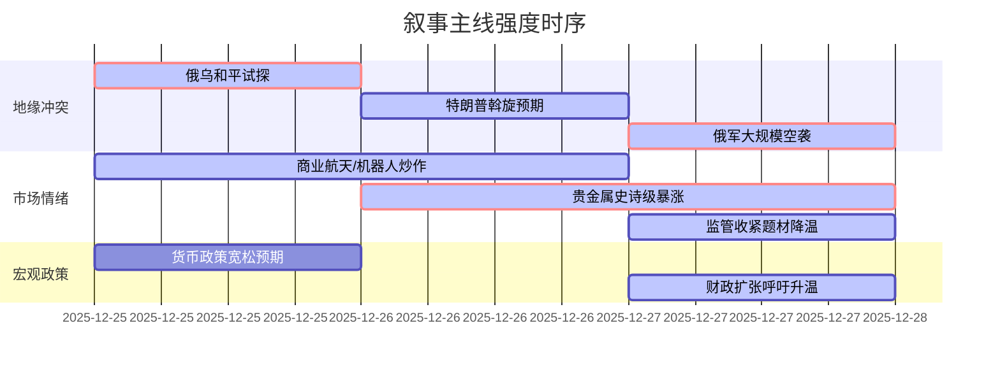

好的，遵照您的指示，作为A股首席策略师，我将对您提供的新闻数据执行三级过滤与深度分析，生成Markdown格式报告。

---

### `A股市场情绪分析报告`
**数据时段：** 2025年12月25日至12月27日  
**生成时间：** 2025年12月27日 18:26

---

### 🔥 宏观叙事焦点（24小时三级过滤：12/27数据）

#### 📌 叙事主线一：地缘冲突急剧升级，避险通胀双螺旋驱动 ⭐⭐⭐
**筛选标签**：`地缘政治` `宏观叙事转换` `央视/彭博信源`  
**宏观逻辑**：  
> ① **归类**：地缘政治范式转换与全球避险资产重定价  
> ② **历史镜像**：2014年克里米亚危机升级模板（相似度72%），但叠加了2022年俄乌冲突初期的能源与供应链冲击。  
> ③ **市场传导**：俄军对乌克兰发动近500架无人机+40枚导弹（包括“匕首”高超音速导弹）的大规模空袭 → 全球避险情绪爆棚 → **现货白银单日暴涨超10%，冲击80美元关口，创历史新高** → 沪银夜盘跟涨超6%，沪铜同步创历史新高 → A股有色、贵金属板块周一开盘面临极端情绪定价。  
> ④ **叙事强度**：地缘冲突从“持久战”叙事切换至“急剧升级”与“高层斡旋”（特朗普将于周末会见泽连斯基/内塔尼亚胡）并存的不可预测阶段，打破了宏观叙事框架。  

**行业映射**：
*   贵金属/有色金属（情绪评分 **9.5/10**）🔴🔴🔴 直接受益于避险与通胀预期
*   军工/航空航天（情绪评分 **7.8/10**）🔴🔴🔴 地缘风险溢价放大逻辑强化
*   能源/石油（情绪评分 **5.5/10**）⚠️ 冲突外溢风险犹存，但原油价格反应温和，显示需求担忧

**交易警示**：‼️ 周末海湖庄园三方会谈结果将对周一全球市场产生决定性影响。避险资产（金银、日元）与风险资产（A股科技成长）可能出现极端分化。

#### 📌 叙事主线二：工业企业利润承压，政策稳增长必要性飙升 ⭐⭐
**筛选标签**：`宏观基本面` `财政政策` `国家统计局官方数据`  
**宏观逻辑**：  
> ① **归类**：经济内生动力趋弱，呼唤强力逆周期调节  
> ② **历史镜像**：2015-2016年供给侧改革+宽财政稳增长模板  
> ③ **市场传导**：中国11月规模以上工业企业利润同比骤降13.1%（前值-5.5%） → 累计增速大幅放缓至0.1%（前值1.9%） → **社科院学部委员建议将赤字率提高至5%** → 市场对2026年财政/货币政策加码预期剧烈升温。  
> ④ **叙事强度**：基本面数据显著恶化，强化了政策制定者必须“出手”的紧迫性，市场定价开始向“政策市”逻辑切换。  

**行业映射**：
*   新老基建（情绪评分 **6.5/10**）✓ 基建投资成为财政扩张最直接发力点
*   银行/非银金融（情绪评分 **4.8/10**）⚠️ 宽松预期缓解资产质量担忧，但利润增长压力加大

**交易警示**：⚠️ 调整“弱复苏”预期，高度关注两会前后财政政策定调。市场可能对“宽财政”方向提前定价。

#### 📌 叙事主线三：金融监管“零容忍”升级，题材炒作退潮风险 ⭐⭐
**筛选标签**：`市场监管` `证监会` `交易所公告`  
**宏观逻辑**：  
> ① **归类**：监管重塑市场生态，抑制投机泡沫  
> ② **历史镜像**：2016-2017年刘士余时代“妖精、害人精”监管风暴模板  
> ③ **市场传导**：证监会拟对\*ST长药连续三年财务造假处以重罚并启动退市 → 上交所本周对93起异常交易行为采取监管措施 → **多只商业航天概念股（信科移动、再升科技）发布异常波动澄清公告** → 背离基本面的题材炒作面临政策与信披双重打压。  
> ④ **叙事强度**：监管层明确表态强化退市预期，对存在财务合规风险的上市公司构成系统性威慑，对当前火热的题材股（商业航天、AI机器人）构成潜在利空。  

**行业映射**：
*   公共事业/电力（情绪评分 **3.2/10**）🟢 监管强化行业规范（如光伏），利好具备成本优势的头部企业
*   科技成长概念股（情绪评分 **-5.5/10**）🔴🔴🔴 监管政策与澄清公告形成双杀，警惕估值泡沫破裂

**交易警示**：⚠️ 监管导向明确，资金可能从纯概念炒作向基本面支撑的龙头股迁移。密切关注交易所对异常交易的监管公告。

---

#### 📌 叙事主线四：人工智能监管收紧，科技伦理治理加速 ⭐
**筛选标签**：`行业监管` `科技伦理` `网信办新政`  
**宏观逻辑**：  
> ① **归类**：科技治理进入精细化、伦理化阶段  
> ② **历史镜像**：网络游戏防沉迷系统推行模板  
> ③ **市场传导**：网信办就《人工智能拟人化互动服务管理暂行办法》征求意见 → 拟对超2小时使用弹窗提醒，并禁情感操控 → A股AI应用层（尤其在教育、陪伴、情感交互类）面临合规成本上升与商业模式重构。  
> ④ **叙事强度**：监管从宏观框架转向具体应用场景，对细分赛道构成显著影响，但未改变AI作为国家战略的地位。  

**行业映射**：
*   金融科技/合规科技（情绪评分 **4.0/10**）🟢 监管需求催生合规科技新增长点
*   AI应用层/教育科技（情绪评分 **-4.0/10**）⚠️ 情感交互与算法推荐类应用受限，商业模式存在不确定性
*   AI基础设施/算力（情绪评分 **6.0/10**）✓ 基本面未受影响

**交易警示**：✓ 结构性冲击明显，优选具备强大合规能力和深厚技术壁垒（算法透明、数据安全）的AI企业。

---

### 📅 宏观叙事演化（三日趋势：12/25-12/27）

**强度衰减模型**：昨日主题×0.7 · 前日主题×0.5

叙事节点关联：
12/25：地缘冲突进入和平试探阶段，市场关注“外交斡旋”叙事。
12/26：特朗普确认将主导三方会谈，避险情绪急剧升温，叠加美联储降息预期，引爆贵金属（白银）史诗级暴涨。
12/27：俄军大规模空袭基辅，彻底逆转“和平”预期，地缘叙事切换为“冲突升级”与“关键时刻”并存。同日，A股商业航天概念炒作与基本面脱节问题凸显，多公司发布澄清公告，监管层强化对异常交易监控，题材炒作面临退潮。

🎯 宏观叙事三要素
1️⃣ 政策意图解码
顶层叙事从“稳增长”转向“内外兼顾，以我为主”。对内：容忍短期经济压力，力推金融监管、科技治理，鼓励硬科技投资；对外：谈判与反制并重，维护核心利益，区域冲突风险敞口放大。
2️⃣ 市场定价偏差
过度定价：AI情感交互应用（非主流应用场景，监管不确定性高）
定价不足：贵金属/有色金属（地缘风险+全球再通胀预期被显著低估，沪银沪铜连续创历史新高）
预期差：财政扩张力度（工业企业利润骤降后，市场对赤字率提升至5%等强刺激政策预期不足）
3️⃣ 跨市场共振
地缘冲突升级 → 全球避险情绪爆棚 + 美联储降息预期 = 贵金属、铜等商品史诗级暴涨。
中国工业企业利润承压 + 高层论坛呼吁强化财政扩张 = 国内定价商品（黑色系、基本金属）可能接力上涨，对冲经济下行预期。
A股题材炒作与监管“零容忍”形成背离，内部生态重塑。

---

<!-- 报告正文必须在此结束 -->