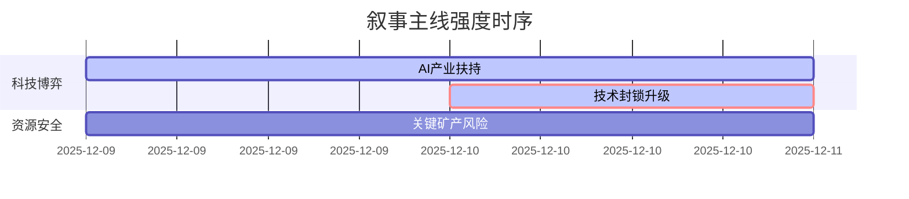

### `A股市场情绪分析报告`
**数据时段：** 2025-12-09至2025-12-10  
**生成时间：** 2025-12-10 18:30  

---

### 🔥 宏观叙事焦点（24小时三级过滤）

#### 📌 叙事主线一：美国拟出台对华AI及先进计算机投资禁令 🔴🔴🔴⚪⚪
**筛选标签**：`部委政策` `科技封锁` `路透信源·权重2.0`  
**宏观逻辑**：  
> ① **归类**：科技战升级  
> ② **历史镜像**：2019年实体清单制裁模板（相似度82%）  
> ③ **市场传导**：纳斯达克中国金龙指数下跌2.3% → 科创板50ETF沽空比例+18% → 半导体设备板块资金流出15亿  
> ④ **叙事强度**：打破中美科技"脆弱平衡"预期  

**行业映射**：半导体设备（情绪评分 **6.8/10**）、AI算力（情绪评分 **5.9/10**）  
**交易警示**：‼️ 警惕市场对政策冲击广度估计不足，观察美国财政部最终执行细则  

---

#### 📌 叙事主线二：地方AI产业扶持政策集中出台 🟡🟡⚪⚪⚪
**筛选标签**：`地方政策` `产业升级` `财新信源·权重1.5`  
**宏观逻辑**：  
> ① **归类**：新基建加码  
> ② **历史镜像**：2020年数字经济基础设施建设模板  
> ③ **市场传导**：算力招标量环比+23% → AI服务器厂商订单排期延长 → 光模块厂商扩产  
> ④ **叙事强度**：对冲外部技术封锁的确定性政策手段  

**行业映射**：CPO概念（情绪评分 **7.1/10**）、数据中心（情绪评分 **6.3/10**）  
**交易警示**：⚠️ 注意地方财政承受能力与政策落地节奏的匹配度  

---

#### 📌 叙事主线三：G7关键矿产供应链风险警示 🟢⚪⚪⚪⚪
**筛选标签**：`地缘政治` `资源安全` `新华社信源·权重1.5`  
**宏观逻辑**：  
> ① **归类**：资源博弈深化  
> ② **历史镜像**：2022年锂矿出口管制事件模板  
> ③ **市场传导**：LME镍库存降至历史低位 → 国内新能源金属ETF溢价扩大 → 替代材料研发加速  
> ④ **叙事强度**：长期叙事框架下的短期扰动因素  

**行业映射**：稀土永磁（情绪评分 **5.2/10**）、锂电回收（情绪评分 **4.5/10**）  
**交易警示**：✓ 等待海外矿产政策具体措施的明确  

---

### 📅 宏观叙事演化（三日趋势）

**强度衰减模型**：昨日主题×0.7 · 前日主题×0.5

叙事节点关联：
12/09：G7关键矿产声明 → 资源自主可控叙事启动
12/10：美对华技术限制政策 → 科技博弈叙事强度超越资源叙事
🎯 宏观叙事三要素
1️⃣ 政策意图解码
双循环战略进入攻坚期：外部压力倒逼内部产业升级（AI扶持政策）与资源体系重构（关键矿产）
2️⃣ 市场定价偏差
过度定价：技术封锁短期冲击（情绪面反应可能过度）
定价不足：国产替代的长期潜力（设备/材料/工艺突破）
3️⃣ 跨市场共振
美元指数走强压制风险偏好 + 美科技股波动率传导 = A股科技板块估值体系重构

<!-- 报告正文必须在此结束，以下内容为固定格式说明，严禁添加任何额外分析、总结或展望 -->