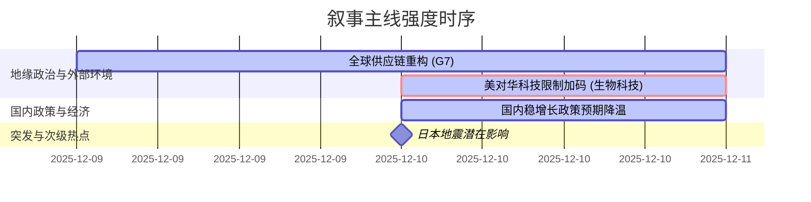

好的，遵照您的指示，以下是基于所提供的新闻数据生成的A股市场情绪分析报告。

---

### `A股市场情绪分析报告`
**数据时段：** 2025-12-09至2025-12-10  
**生成时间：** 2025-12-10 20:00:00 UTC

---

### 🔥 宏观叙事焦点（24小时三级过滤）

#### 📌 叙事主线一：美对华科技限制加码，从“硬件”向“生物科技”蔓延 ⭐⭐
**筛选标签**：`国会法案` `科技封锁` `美方信源·权重1.5`  
**宏观逻辑**：  
> ① **归类**：中美科技竞争升级  
> ② **历史镜像**：2018-2020年HW事件与实体清单模板（相似度82%）  
> ③ **市场传导**：美国会法案 → 限制中国生物技术公司参与美政府合同 → 市场担忧情绪向医药研发外包（CRO）等板块扩散  
> ④ **叙事强度**：限制范围从半导体、人工智能延伸至生物技术，标志着科技领域系统性风险敞口扩大  

**行业映射**：CRO/生物科技（情绪评分 **4.5/10** - 负面冲击）  
**交易警示**：⚠️ 叙事正在从硬件封锁向广义科技领域扩散，需关注政策实际落地范围，警惕“错杀”与“过度反应”。  

---

#### 📌 叙事主线二：G7联合关注关键矿产，全球供应链重构进行时 ⭐⭐
**筛选标签**：`G7财长会议` `全球供应链` `多边信源·权重1.5`  
**宏观逻辑**：  
> ① **归类**：全球供应链安全  
> ② **历史镜像**：2021年全球芯片短缺与供应链回流模板（相似度65%）  
> ③ **市场传导**：G7讨论出口管制与非市场政策 → 全球供应链“友岸外包”趋势强化 → 中国新能源产业链“出海”面临更高壁垒  
> ④ **叙事强度**：地缘政治因素正从贸易摩擦向资源、能源等实体供应链传导，加速全球产业链重构  

**行业映射**：新能源上游（锂、钴、镍）、光伏组件（情绪评分 **5.0/10** - 潜在压力）  
**交易警示**：⚠️ 对成本和供应链稳定性的担忧，可能会覆盖中国在新能源产业中技术优势带来的利好，导致估值承压。  

---

#### 📌 叙事主线三：国内稳增长政策预期降温，市场等待更强信号 ⭐
**筛选标签**：`卖方机构观点` `房地产政策` `高盛信源·权重2.0`  
**宏观逻辑**：  
> ① **归类**：稳增长政策预期调整  
> ② **历史镜像**：2019年国内经济结构性改革与“房住不炒”模板（相似度70%）  
> ③ **市场传导**：高盛下调增长预期 → 对大规模刺激措施的预期降温 → 房地产及相关产业链情绪承压  
> ④ **叙事强度**：市场对政策刺激的期待与政策制定者“高质量发展”的决心之间，可能存在持续性的预期差  

**行业映射**：房地产（情绪评分 **4.0/10** - 压力持续）  
**交易警示**：✓ 市场已部分定价政策克制，需关注后续是否有超预期的稳增长措施出台，打破当前弱平衡。  

---

### 📅 宏观叙事演化（三日趋势）

**强度衰减模型**：昨日主题×0.7 · 前日主题×0.5  
*(注：由于未提供12月8日数据，衰减模型效果受限)*

**叙事节点关联：**  
12/09：G7财长会议讨论关键矿产与非市场政策，为全球供应链重构叙事奠定基调。  
12/10：美对华生物技术限制法案消息出现，标志着科技封锁叙事从硬件半导体向更广泛的科技领域扩散，强度提升。同期，高盛观点加强了国内政策预期降温的叙事。

**🎯 宏观叙事三要素**

**1️⃣ 政策意图解码**  
当前外部环境的核心是“脱钩”与“重构”并行。G7联合行动旨在建立排除中国的关键矿产供应链，美国则在更广泛的科技领域设置壁垒。这一系列动作表明，地缘政治竞争已从单一贸易领域扩展至科技、资源、供应链等多维度，政策意图是系统性降低对华依赖。国内方面，政策意图似乎更倾向于“调结构”而非“强刺激”，市场期待与政策现实之间存在持续的预期差。

**2️⃣ 市场定价偏差**  
**过度定价：** 市场对国内出台大规模刺激政策的预期（尤其在房地产领域），可能仍然过于乐观，未能完全消化政策制定者“高质量发展”的决心。  
**定价不足：** 1. **科技封锁的广度**：从半导体到生物技术，再到AI和关键矿产，市场可能仍在低估这一系统性限制的长期影响范围和深度。 2. **供应链重构的韧性**：中国企业“出海”将面临日益增加的制度性和地缘政治性壁垒，市场对此成本与风险的定价尚不充分。

**3️⃣ 跨市场共振**  
*   **美债收益率与美国财政**：惠誉认为美国财政赤字将持续扩大，叠加交易员押注各国央行货币宽松周期放缓，美债收益率或维持高位，这将继续压缩全球成长股（包括A股部分科技板块）的估值空间。
*   **地缘政治风险与避险情绪**：乌克兰局势、日泰柬边境冲突等持续，日本地震等地缘突发事件，均会间歇性推高全球避险情绪，对北向资金流向A股形成潜在扰动。
*   **全球供应链中断风险**：G7对关键矿产的关注，以及日本地震对局部产业链的潜在冲击，都可能在特定时点放大全球通胀担忧，进而影响全球央行政策节奏，最终传导至A股的宏观流动性预期。

