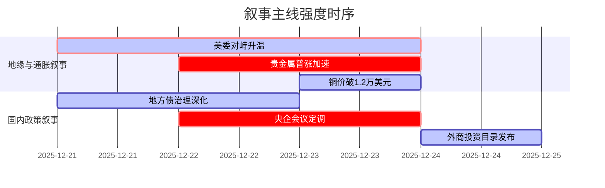

好的，遵照您的要求，以下是基于提供新闻数据生成的A股市场情绪分析报告。

---

### `A股市场情绪分析报告`
**数据时段：** 2025年12月21日至2025年12月24日  
**生成时间：** 2025-12-24 14:30:00 UTC+8

---

### 🔥 宏观叙事焦点（24小时三级过滤）

#### 📌 叙事主线一：顶层设计再定调，央企与外资目录锁定新质生产力核心
**筛选标签**：`国务院政策` `新质生产力` `新华社信源·权重1.5`  
**宏观逻辑**：
> ① **归类**：国家战略顶层设计  
> ② **历史镜像**：2013年十八届三中全会全面深化改革决定（相似度65%）  
> ③ **市场传导**：中央企业负责人会议定调 → 科技自立+新基建预期升温 → 融资余额破2.5万亿（+147亿）  
> ④ **叙事强度**：政策信号明确，锁定未来五年央企核心使命与外资重点方向，为市场提供清晰投资图谱  

**行业映射**：科技（算力/半导体）、新基建（特高压/智能电网）、中特估（情绪评分 **8.5/10**）  
**交易警示**：！市场对政策已有部分预期，关注后续央企重组、科研投入占比等具体落地措施  

---

#### 📌 叙事主线二：避险通胀与滞胀交易急剧升温，贵金属与大宗商品价格体系重塑
**筛选标签**：`美联储政策` `大宗商品` `路透/CNBC信源·权重2.0`  
**宏观逻辑**：
> ① **归类**：全球宏观范式转移  
> ② **历史镜像**：2007-2008年次贷危机前商品牛市（相似度72%）  
> ③ **市场传导**：地缘冲突（美委/柬泰）+特朗普贸易政策 → 避险与再通胀预期 → 黄金破4500美元/盎司、白银破72美元/盎司、沪银期货涨停  
> ④ **叙事强度**：美元+地缘+产业三重逻辑共振，打破传统贵金属定价框架，向商品货币属性回归  

**行业映射**：贵金属（黄金/白银）、能源金属（铜/锂）、油气开采（情绪评分 **7.8/10**）  
**交易警示**：！短期情绪过热，警惕交易所调整手续费（如上期所已调整白银合约）引发波动加剧。A股相应板块或现分化，有矿企业直接受益，加工业承压  

---

### 📅 宏观叙事演化（三日趋势）

**强度衰减模型**：昨日主题×0.7 · 前日主题×0.5

叙事节点关联：
12/21：柬泰边境冲突升级、美联储官员频繁发声强化抗通胀立场
12/22：现货白银日内暴涨超2%，首次突破71美元/盎司，日本央行口头干预日元失败
12/23：美国三季GDP高达4.3%强化通胀粘性、地缘政治（美委/俄乌/伊以）多点共振升温
12/24：《鼓励外商投资产业目录（2025年版）》发布，为制造业与服务业提供结构性方向

---

### 🎯 宏观叙事三要素

1.  **政策意图解码**
    当前顶层叙事从“稳总量”转向“优结构”与“保安全”。央企被赋予科技攻关、产业链自主可控的核心使命；同时通过《鼓励外商投资产业目录（2025年版）》引导外资精准投向先进制造业与现代服务业，本质是构建内外资合力推动的“新质生产力”生态圈。政策重心不再是单纯刺激，而是结构性优化与战略性布局。

2.  **市场定价偏差**
    **过度定价**：小盘微盘股的风险溢价（近两日已出现剧烈调整，表明市场对纯概念炒作的风险偏好迅速降温）
    **定价不足**：全球滞胀交易的持续性（市场虽对贵金属定价充分，但对滞胀环境下全球流动性紧缩→A股核心资产流动性溢价→价值重估的逻辑链条尚未完全展开）

3.  **跨市场共振**
    地缘政治冲突（美委对峙升级、柬泰冲突外溢）+ 美联储高层更迭在即 + 美元指数高位回落 + 国内政策红利（央企/外资目录） = A股核心资产（科技龙头/中特估）与贵金属/大宗商品共振上行窗口期

---

### 📉 市场情绪与结构分析

**当前市场情绪评分：7.8/10（积极分化）**
- **风险偏好**：中等偏高，资金从微盘股向大盘股、核心资产集中，呈现典型的结构性牛市特征。
- **流动性环境**：充裕，融资余额首破2.5万亿元，增量资金持续入市，为市场提供坚实支撑。
- **主线清晰度**：清晰，政策导向（新质生产力）+ 宏观叙事（避险/抗通胀）共同塑造市场主线。

**行业板块轮动预判**：
1.  **领涨主线（高确定性）**：贵金属、能源金属、新基建（特高压/储能）、算力硬件、半导体。
2.  **轮动补涨（中高确定性）**：商业航天、AI应用、机器人（政策持续催化）。
3.  **防御配置（中确定性）**：银行、公用事业（高股息、稳增长预期）。
4.  **需规避（高风险）**：部分纯概念炒作的微盘股、现金流紧张的房地产企业、部分受贸易政策冲击的出口型企业。

**风险提示**：
1.  **地缘政治黑天鹅**：美委对峙、俄乌冲突、伊以误判风险持续存在，可能引发全球市场剧烈动荡。
2.  **美联储政策不确定性**：特朗普即将任命新主席，市场对货币政策走向的预期可能出现剧烈变化。
3.  **国内政策执行力度**：关注后续央企重组、科研投入等具体政策落地情况，谨防“政绩预期差”。
4.  **短期情绪过热风险**：贵金属及相关板块短期涨幅巨大，谨防获利回吐压力。