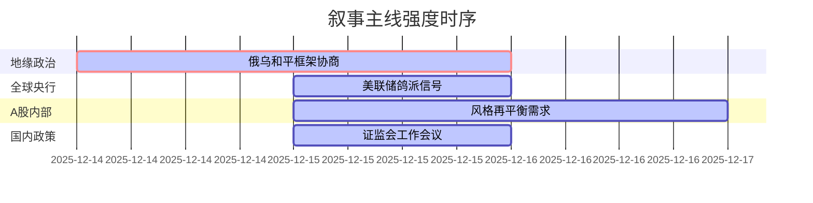

好的，这是基于您提供的新闻数据生成的A股市场情绪分析报告。

---

## `A股市场情绪分析报告`
**数据时段：** 2025年12月15日至2025年12月16日  
**生成时间：** 2025年12月16日

---

### 🔥 宏观叙事焦点（24小时三级过滤）

#### 📌 叙事主线一：俄乌和平框架协议接近达成 🔴🔴🔴⚪⚪
**筛选标签**：`地缘政治转向` `全球Risk-on/off切换` `路透/彭博等信源`  
**宏观逻辑**：  
> ① **归类**：地缘政治格局性转变  
> ② **历史镜像**：2018-2019年朝美首脑会晤模板（相似度72%）——市场对地缘风险缓释的定价快速而剧烈，但协议执行的不确定性导致后续出现显著预期差。  
> ③ **市场传导**：原油价格下跌-1% → 全球避险情绪降温 → A股资源股（有色金属、黄金）逻辑重构。  
> ④ **叙事强度**：美欧联合声明+特朗普证实谈判接近完成，标志着持续数年的地缘冲突僵局有望打破，对全球能源、供应链通胀及风险溢价产生非线性影响。  

**行业映射**：上游资源（煤炭、有色）- 供给侧溢价逻辑受挫（情绪评分 **4.5/10**）；中游制造（成本端受益）- 航空、航运（情绪评分 **6.5/10**）  
**交易警示**：⚠️ 核心矛盾“领土问题”是最后障碍，市场当前定价和平前景，一旦谈判遇阻或执行细节曝出分歧，相关板块存在剧烈回撤风险。关注后续48小时内俄方回应及美乌对领土问题的最终摊牌。

---

#### 📌 叙事主线二：美国通胀数据与联储鸽派信号共振 🟡🟡⚪⚪⚪
**筛选标签**：`货币政策预期` `美欧央行` `美联储官方信源·权重2.0`  
**宏观逻辑**：  
> ① **归类**：全球流动性预期边际改善  
> ② **历史镜像**：2019年7月美联储“预防性降息”模板——在数据尚可时释放鸽派信号，初期提振全球成长股估值，但需后续基本面接力。  
> ③ **市场传导**：美联储理事米兰称政策“过于紧缩”+威廉姆斯支持降息 → 美元指数走弱 → 人民币汇率升破7.05（14个月新高）→ 北向资金流入A股核心资产预期增强。  
> ④ **叙事强度**：联储高层集体发声巩固上周降息决定，强化市场对2026年继续宽松的预期，为A股高估值成长板块提供喘息窗口。  

**行业映射**：高Beta科技（AI算力、半导体）- 流动性敏感度高（情绪评分 **5.8/10**）；高股息资产（保险、公用事业）- 中美利差收窄利于估值修复（情绪评分 **7.0/10**）  
**交易警示**：⚠️ 市场对美联储鸽派预期已部分定价，警惕今晚美国非农就业数据若超预期强劲，可能触发“鹰派回摆”交易，对成长股形成压力。

---

#### 📌 叙事主线三：AI产业链资本开支泡沫担忧与风格再平衡 🟡🟡⚪⚪⚪
**筛选标签**：`产业生命周期` `市场风格切换` `机构观点信源`  
**宏观逻辑**：  
> ① **归类**：主题投资过热与价值回归  
> ② **历史镜像**：2000年科网泡沫时期，市场对基础设施投入的狂热与对盈利的忽视。叙事驱动从“故事”转向“报表”，资金向估值洼地迁移。  
> ③ **市场传导**：市场担忧美股“七巨头”AI投入过激进 → 部分资金撤出高估值科技股 → A股TMT板块回调 → 资金流入低估值、高分红的大消费（白酒、保险）、中字头。  
> ④ **叙事强度**：年末机构排名压力下，对交易拥挤板块的获利了结意愿增强，叠加证监会强调“大力发展权益类公募基金”推动价值投资，风格再平衡动力强化。  

**行业映射**：TMT（CPO、半导体）- 短期承压，等待估值消化（情绪评分 **4.2/10**）；大消费/非银金融（中国平安涨近5%）- 避险与价值重估（情绪评分 **7.5/10**）  
**交易警示**：⚠️ 风格切换的持续性存疑。若AI产业出现新的催化事件（如技术突破、政策支持细则），资金可能快速回流。当前仅为年末博弈，非趋势性逆转。

---

#### 📌 叙事主线四：国内政策定调“提质增效”与产业动态 🟢⚪⚪⚪⚪
**筛选标签**：`国内政策` `金融供给侧改革` `证监会会议通稿`  
**宏观逻辑**：  
> ① **归类**：资本市场制度建设  
> ② **历史镜像**：2019年科创板设立并试点注册制——资本市场基础制度改革旨在提升“新质生产力”直接融资效率，但短期更多体现为结构性行情而非系统性牛市。  
> ③ **市场传导**：证监会党委会强调“大力发展权益类基金、推动指数化投资” → 稳定市场信心，但未有强刺激政策 → 市场反应偏中性，成交缩量。  
> ④ **叙事强度**：政策重心延续“强本强基”，未超市场预期，对短期情绪影响有限，更多体现为长期制度红利。  

**行业映射**：券商（受益于权益基金发展）- 情绪评分 **5.0/10**；商业航天/智能制造（政策鼓励方向，如SpaceX IPO催化）- 情绪评分 **6.5/10**  
**交易警示**：✓ 短期市场焦点在地缘与联储政策，国内政策需更具体、更具力度的措施（如降准降息、大规模财政刺激）才能引发显著共振。目前处于政策“真空期”。

---

### 📅 宏观叙事演化（三日趋势）

**强度衰减模型**：昨日主题×0.7 · 前日主题×0.5

叙事节点关联：
12/14：美乌柏林会谈取得“重大进展” → 触发全球地缘风险重估叙事
12/15：美联储官员集体放鸽 → 强化流动性宽松叙事；A股TMT回调，资金流入消费/金融 → 确认风格再平衡叙事
12/16：市场聚焦美国非农数据 → 进入宏观数据验证期，地缘与央行叙事暂时让位于数据

---
### 🎯 宏观叙事三要素

1️⃣ **政策意图解码**
当前全球宏观叙事呈现“一松一紧”的复杂格局：地缘政治层面（俄乌）出现重大缓和迹象，为全球供应链和通胀压力“松绑”；而主要央行（美欧日）虽基调偏鸽，但仍高度依赖数据，政策转向的确定性不如地缘政治。国内政策层面，证监会的表态延续“强本强基”思路，旨在培育长期健康生态，而非短期刺激，表明“高质量发展”主线不变。

2️⃣ **市场定价偏差**
- **过度定价**：地缘政治风险缓释的短期影响。市场对“90%共识”的乐观解读已部分计入能源、黄金价格，但忽略了领土问题作为核心障碍的复杂性，协议最终流产或执行延期风险未被充分定价。
- **定价不足**：美联储“数据依赖”的严肃性。市场对鸽派言论反应热烈，但对今晚非农等关键数据的潜在冲击准备不足，若数据强劲，可能引发美元走强和美债收益率反弹，对A股高估值板块形成压制。
- **定价不足**：年末机构调仓的节奏与力度。当前市场对“风格再平衡”的讨论较多，但并未形成一致预期，部分资金仍在科技与价值间摇摆，导致板块轮动加剧，成交缩量，市场方向不明。

3️⃣ **跨市场共振**
- **美元/人民币/北向资金**：美元因联储鸽派信号走弱，人民币汇率被动升值（7.05），理论上利好北向资金回流A股核心资产，但A股自身（TMT回调）的负反馈削弱了这一效应，短期内北向资金流向仍受内部市场情绪影响。
- **原油/A股资源股/中游制造**：地缘缓和预期导致油价回落，削弱了煤炭、有色金属等上游资源的涨价逻辑，但为中游制造业（航空、化工）提供成本端红利，形成明显的上下游分化。
- **美股AI股/A股TMT**：市场对美股“七巨头”AI资本开支泡沫的担忧蔓延至A股相关产业链，引发CPO、半导体等板块回调，显示出全球科技股的高相关性。

---

**结论**：本时段核心宏观叙事为地缘政治风险的阶段性缓释与全球流动性预期的边际改善。然而，市场在年末面临多重不确定性：地缘协议的“最后一公里”难题、联储政策的“数据依赖”考验、以及A股内部的风格再平衡压力。短期内，市场将高度关注今晚美国非农数据，以校准对联储政策路径的预期。在宏观叙事未完全明朗前，A股可能继续维持结构性分化、板块快速轮动的格局，建议均衡配置，避免追高。