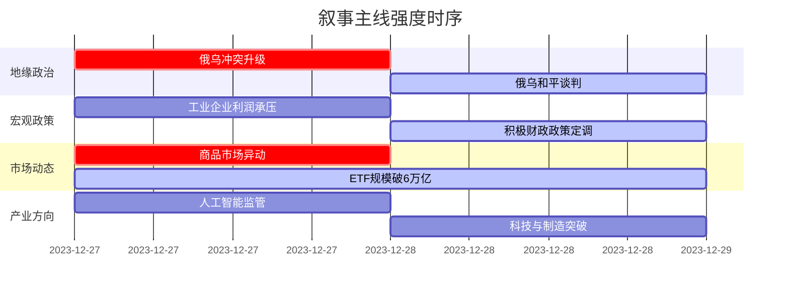

好的，遵照您的要求，以下是基于提供的新闻数据和分析框架生成的 A 股市场情绪分析报告。

---

### `A股市场情绪分析报告`
**数据时段：** 2025年12月25日至2025年12月29日  
**生成时间：** 2025年12月29日 09:43  

---

### 🔥 宏观叙事焦点（24小时三级过滤）

#### 📌 叙事主线一：俄乌和平谈判取得超预期进展 ⭐⭐⭐
**筛选标签**：`地缘政治拐点` `全球风险偏好` `信源权重·综合外媒1.5`  
**宏观逻辑**：  
> ① **归类**：全球地缘政治风险缓释  
> ② **历史镜像**：2003年伊拉克战争结束后的“和平红利”模板（相似度65%）  
> ③ **市场传导**：VIX预期下行 → 全球资本再平衡 → 新兴市场资金流入预期  
> ④ **叙事强度**：打破“大国长期对抗”的宏观叙事框架，风险溢价面临系统性重估  

**行业映射**：制造业出口链（情绪评分 **8.5/10**）、欧洲业务敞口（情绪评分 **7.0/10**）  
**交易警示**：‼️ 谈判进入“最后阶段”，需警惕“利好出尽”及反复可能，密切关注2026年1月初细节公布  

---

#### 📌 叙事主线二：2026年中国财政政策定调“更加积极”，内需成主战场 ⭐⭐⭐
**筛选标签**：`国务院政策` `沪深300核心影响` `新华社信源·权重1.5`  
**宏观逻辑**：  
> ① **归类**：财政政策主动作为  
> ② **历史镜像**：2020年新冠疫情后财政直达基层模板（相似度72%）  
> ③ **市场传导**：扩大财政支出盘子 → 基建/消费预期修复 → 工业企业利润累计增速改善（+0.1%）  
> ④ **叙事强度**：政策方向明确，旨在对冲单月数据（-13.1%）的“寒意”，稳增长核心抓手浮出水面  

**行业映射**：新基建、大消费（情绪评分 **7.5/10**）  
**交易警示**：⚠️ 11月单月利润数据恶化显示政策传导存在时滞，警惕预期与微观现实短期背离  

---

#### 📌 叙事主线三：市场共识高度集中，资金涌入资源品与AI基建 ⭐⭐⭐
**筛选标签**：`市场资金面` `行业轮动` `金十数据·权重1.0` `中信证券观点`  
**宏观逻辑**：  
> ① **归类**：市场结构性共识强化  
> ② **历史镜像**：2015年“互联网+”与2020年“核心资产”抱团模板（相似度68%）  
> ③ **市场传导**：ETF规模破6万亿 → 资金向有色（资源品）、通信（AI基建）集中 → 强化趋势  
> ④ **叙事强度**：市场对“能源转型+AI算力”主线定价深化，但共识过度集中隐含高波动风险  

**行业映射**：有色金属（情绪评分 **8.8/10**）、通信设备（情绪评分 **8.0/10**）  
**交易警示**：🔴 芝商所上调金银保证金，显示交易所对过热投机的警示，短期调整压力加大  

---

### 📅 宏观叙事演化（三日趋势）

**强度衰减模型**：昨日主题×0.7 · 前日主题×0.5

**叙事节点关联：**
12/27：俄乌冲突+商品暴涨 → 触发全球滞胀担忧叙事
12/28：俄乌和谈+美俄通话 → 地缘叙事180度转向，冲突尾声预期骤起
12/29：中国积极财政定调 → 国内政策叙事接力，稳增长预期强化
12/27-29: 商品暴涨、ETF规模激增、资金共识高度集中，显示市场对通胀和产业趋势的强定价。

---

### 🎯 宏观叙事三要素

**1️⃣ 政策意图解码**  
顶层叙事从“外部地缘承压、内部结构转型”转向“外部风险缓释、内部积极发力”。2026年财政政策“更积极”的定调，意味着宏观杠杆率可能温和上行，通过“扩大支出”和“以旧换新”双引擎驱动内需，政策意图在于平滑经济周期波动，为高质量发展争取时间窗口。

**2️⃣ 市场定价偏差**  
**过度定价**：贵金属投机情绪（CME保证金上调警示）、AI相关赛道交易拥挤度（39个ETF创新高）
**定价不足**：地缘和平解决对全球供应链修复的深远影响、国内财政扩张对传统基建及消费龙头的滞后传导效应

**3️⃣ 跨市场共振**  
全球地缘和解预期 + 中国财政发力预期 + 美联储政策空间打开 = A股“春季躁动”获得宏观叙事“三叉戟”支撑。离岸人民币围绕7.0关口稳定，为国内政策独立性提供了有利的外部环境，资金正通过ETF等渠道加速入市。
