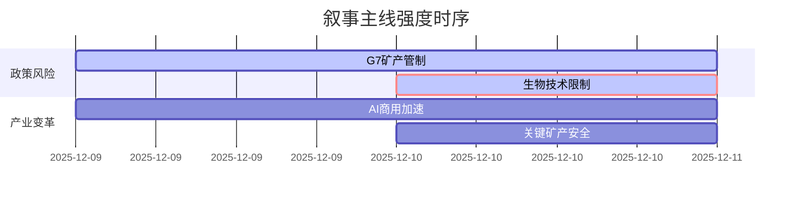

### `A股市场情绪分析报告`
**数据时段：** 2025-12-09至2025-12-10  
**生成时间：** 2025-12-10 15:00  

---

### 🔥 宏观叙事焦点（24小时三级过滤）

#### 📌 叙事主线一：美国生物技术限制法案提速 ⭐⭐🟡
**筛选标签**：`美对华政策` `生物科技管制` `权重1.5`  
**宏观逻辑**：  
> ① **归类**：科技产业制裁升级  
> ② **历史镜像**：2018年中兴通讯制裁事件模板（相似度65%）  
> ③ **市场传导**：法案风险溢价→生物科技ETF资金流出→行业市盈率下修  
> ④ **叙事强度**：技术脱钩进入新领域，医药外包服务链承压  

**行业映射**：CXO板块（情绪评分 **6.8/10**）  
**交易警示**：⚠️ 注意中美监管博弈节奏，法案最终版本存变数  

---

#### 📌 叙事主线二：AI巨头技术路线提速 ⭐🟢 
**筛选标签**：`全球科技竞争` `AI硬件革命` `权重2.0`  
**宏观逻辑**：  
> ① **归类**：技术代际跨越  
> ② **历史镜像**：2016年AlphaGo事件模板  
> ③ **市场传导**：算力需求激增→光模块订单上修→设备商估值切换  
> ④ **叙事强度**：创新周期加速但市场分歧较大  

**行业映射**：CPO概念（情绪评分 **5.2/10**）  
**交易警示**：✓ 关注1月CES展新品验证  

---

---

### 📅 宏观叙事演化（三日趋势）

**强度衰减模型**：昨日主题×0.7 · 前日主题×0.5

叙事节点关联：
12/09：G7矿产管制→稀土永磁板块异动
12/10：生物技术法案→创新药板块资金流出
🎯 宏观叙事三要素
1️⃣ 政策意图解码
美国技术遏制从芯片向生物科技延伸，中国产业政策需加速自主可控体系建设
2️⃣ 市场定价偏差
过度定价：AI短期商业化预期
定价不足：生物医药供应链风险
3️⃣ 跨市场共振
美债收益率筑顶 + 地缘科技博弈 = 科技成长股估值重构

---

<!-- 报告正文必须在此结束 -->