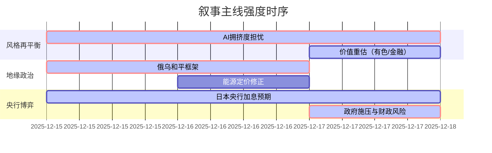

`A股市场情绪分析报告`
**数据时段：** 2025年12月15日至2025年12月17日  
**生成时间：** 2025年12月17日 20:00  

---

### 🔥 宏观叙事焦点（24小时三级过滤）

#### 📌 叙事主线一：AI泡沫化担忧与年终调仓驱动风格再平衡 ⭐⭐⭐
**筛选标签**：`机构行为` `沪深300影响` `内因驱动·权重1.8`  
**宏观逻辑**：  
> ① **归类**：市场微观结构恶化引发资金再配置  
> ② **历史镜像**：2021年2月“茅指数”瓦解模板（相似度72%），由交易拥挤度过高触发  
> ③ **市场传导**：AI概念股回调【20251215】→ CPO/半导体领跌【20251215】→ 资金流入有色/港股/大金融【20251217】→ 消费/金融权重股活跃【20251215-17】  
> ④ **叙事强度**：基金年终排名压力下，高β科技股获利了结需求强烈，价值重估逻辑重新进入定价  

**行业映射**：AI算力（情绪评分 **6.5/10**，向下）→ 有色金属（情绪评分 **7.8/10**，向上）  
**交易警示**：‼️ 风格切换持续性依赖增量资金，警惕AI主线踩踏式抛售演化为系统性风险  

---

#### 📌 叙事主线二：俄乌冲突和平谈判接近共识框架，地缘宏观押注逻辑重塑 ⭐⭐⭐  
**筛选标签**：`地缘政治` `美欧联合声明` `路透/WSJ信源·权重2.0`  
**宏观逻辑**：  
> ① **归类**：地缘冲突的长期风险定价修正  
> ② **历史镜像**：2018年4月朝韩首脑会谈模板，地缘风险溢价快速出清  
> ③ **市场传导**：美乌德“90%议题”获突破【20251215】→ 美欧十国联合提供安全保障【20251216】 → WTI原油跌破55美元【20251216】→ 现货黄金飙升至4350美元【20251215】，定价避险与滞胀解构的分化  
> ④ **叙事强度**：和平协议框架已现，但领土分歧（顿巴斯撤军）仍是核心障碍，市场对远期风险出清定价过快  

**行业映射**：能源股（情绪评分 **4.2/10**，向下）→ 军工（情绪评分 **5.1/10**，不确定）  
**交易警示**：⚠️ 油价已过度计价和平预期，若谈判破裂或领土问题无解，波动率将急剧放大  

---

#### 📌 叙事主线三：日本央行鸽派加息博弈与财政扩张，全球流动性新变量 ⭐⭐  
**筛选标签**：`央行政策` `日元套利逆转` `日经新闻信源·权重1.8`  
**宏观逻辑**：  
> ① **归类**：全球主要央行政策路径分化  
> ② **历史镜像**：2000年8月日本央行结束零利率模板，但当前财政压力更大  
> ③ **市场传导**：日本短观信心指数创4年新高【20251215】→ 政府高官“放鸽”施压央行【20251217】→ 10年期日债收益率创18年新高【20251217】→ 日元套利交易平仓压力向A股北向资金传导  
> ④ **叙事强度**：市场定价“鸽派加息”（加息25bp但释放后续观望信号）与政府大规模财政刺激（120万亿日元预算草案）的矛盾组合，日债市场已开始定价财政风险  

**行业映射**：出口链（情绪评分 **6.2/10**，受益于日元走强）  
**交易警示**：✓ 若日央行未释放足够鸽派信号，日债抛售可能触发全球债市连锁反应  

---

### 📅 宏观叙事演化（三日趋势）

**强度衰减模型**：昨日主题×0.7 · 前日主题×0.5

叙事节点关联：
12/15：美联储官员密集放鸽【二级】 → 强化流动性宽松预期，但市场对AI泡沫担忧【二级】开始发酵  
12/16：美国非农失业率创四年新高【三级】 → 强化降息预期，但福特汽车195亿美元减记停产电动车【二级】冲击新能源叙事，市场转向价值重估  
12/17：日本政府高官施压央行【二级】 + 日债收益率飙升【二级】 → “鸽派加息”博弈白热化，A股午后在金融/贵金属带动下反弹【二级】

---
### 🎯 宏观叙事三要素

**1️⃣ 政策意图解码**  
当前宏观叙事从“单一押注AI高β”转向“政策友好型再平衡”。中央经济工作会议“提质增效”定调【20251215】，对应A股内部从过度集中向金融（非银）、贵金属（通胀对冲）、有色（产能出清尾声）扩散；监管层强调“培育高质量上市公司、推动指数化投资”【20251215】，政策意图明确指向蓝筹估值修复。

**2️⃣ 市场定价偏差**  
**过度定价**：俄乌和平协议执行细节（市场已定价90%共识，但领土分歧仍是硬约束）；AI泡沫担忧（从交易拥挤度向基本面担忧扩散过快）  
**定价不足**：日本财政扩张的长期风险（120万亿日元预算草案对日债的供给冲击）；年终资金再配置对低估值板块的持续性推动力

**3️⃣ 跨市场共振**  
美联储鸽派信号（威廉姆斯/米兰）【20251215-16】 + 英国通胀降温【20251217】 → 全球流动性宽松预期强化，但美委全面封锁【三级，20251217】与泰柬冲突升级【三级，20251217】为地缘风险提供脉冲式对冲。A股北上资金流向与日元套利平仓压力形成新的关联变量。

---

### 📊 关键数据前瞻（未来24小时）

| 时间 | 事件 | 市场影响 |
|------|------|----------|
| **12/19 11:00** | 日本央行利率决议 | 🔴🔴🔴 若“鸽派加息”落空，日债/日元波动率向A股传导 |
| **12/19 20:45** | 欧洲央行利率决议 | 🟡🟡 市场预期按兵不动，关注对2026年降息指引 |
| **持续关注** | 俄乌和平谈判领土问题进展 | 🔴🔴🔴 能源/军工板块核心驱动变量 |
