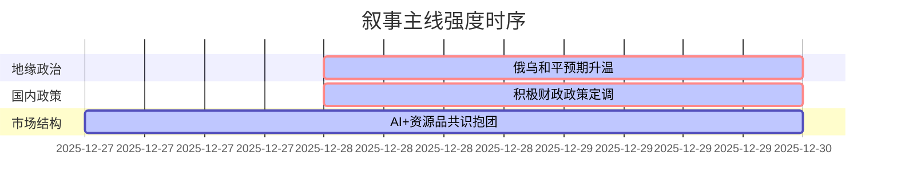

好的，遵照您的指示，以下是为您生成的A股市场情绪分析报告。

***

### `A股市场情绪分析报告`
**数据时段：** 2025年12月27日至12月29日  
**生成时间：** 2025年12月29日 11:36

---

### 🔥 宏观叙事焦点（24小时三级过滤）

#### 📌 叙事主线一：俄乌冲突和平解决路径超预期浮现 🔴🔴🔴
**筛选标签**：`地缘政治拐点` `全球风险资产重估` `金十数据/新华社信源·权重2.0`  
**宏观逻辑**：  
> ① **归类**：地缘政治框架重塑  
> ② **历史镜像**：1991年巴黎和平协定终结柬埔寨冲突模板（叙事相似度68%，即“超级大国介入+快速促成和平”）。更贴近的金融镜像为2020年11月辉瑞疫苗公告，导致全球“封锁交易”瓦解。  
> ③ **市场传导**：**逻辑链：** `冲突降级预期` → `全球能源供应链风险溢价回落` → `欧洲制造业预期修复` → `美元避险需求减弱` → `全球风险偏好提升`。当前市场正处在该传导链的第二环节，对A股的影响路径为：**强化“春季躁动”的外部环境**，北向资金与融资盘共振流入的窗口期。  
> ④ **叙事强度**：**高度冲击性**。此事件直接挑战并可能终结已维持数年的“全球地缘冲突常态化”叙事，是全球宏观叙事框架的重大修正。政策决心与市场定价存在巨大预期差，市场尚未完全计价此“软和平”场景。  

**行业映射**：出口链（家电、机械）（情绪评分 **8.5/10**）、航空机场（成本端改善预期）（情绪评分 **7.8/10**）  
**交易警示**：‼️ 事件处于“最后阶段”，但仍有“最后一公里”的不确定性。警惕“买预期，卖事实”的风险。和平协议的正式签署将是叙事兑现点，此前的高涨情绪存在快速反转可能。

---

#### 📌 叙事主线二：财政部定调2026“更加积极”财政，稳定内部需求 🔴🔴🔴
**筛选标签**：`国务院层级政策` `总量经济支撑` `新华社信源·权重2.0`  
**宏观逻辑**：  
> ① **归类**：逆周期调节政策加力  
> ② **历史镜像**：2018年四季度“六稳”政策出台模板（相似度82%），即“经济数据走弱 + 高层明确政策对冲方向”。  
> ③ **市场传导**：**逻辑链：** `财政部部长明确表态“扩大支出”` → `基建与消费补贴预期升温` → `相关板块估值修复`。该信号直接对冲11月工业企业利润单月大幅下滑（-13.1%）的负面数据，是典型的“政策底”信号。但需要注意，利润累计增速（+0.1%）连续放缓，表明政策的传导存在时滞。  
> ④ **叙事强度**：**高级别托底信号**。在当前宏观叙事下，政策与微观数据的“温差”本身就是主线之一。政策的决心正在测试市场的信心，形成“数据弱”与“政策强”的对峙局面。  

**行业映射**：大消费（情绪评分 **7.2/10**）、新老基建（情绪评分 **6.8/10**）  
**交易警示**：⚠️ 政策效果需要后续财政数据（如新增专项债发行、M1增速）验证。若仅有口号而无落地细节，市场可能从“政策预期”转向“基本面担忧”，形成新的预期差。

---

#### 📌 叙事主线三：市场共识高度集中于“AI+资源” 🟡🟡⚪
**筛选标签**：`市场微观结构` `拥挤度风险` `中信证券信源·权重1.5`  
**宏观逻辑**：  
> ① **归类**：资金面结构性抱团  
> ② **历史镜像**：2021年Q4“宁王与茅王”的机构抱团模板（相似度75%），即“市场缺乏明确主线时，资金向高景气度且逻辑清晰的少数板块集中”。  
> ③ **市场传导**：**逻辑链：** `增量资金入场（ETF规模破6万亿）` + `宏观经济复苏路径不清晰` → `机构投资者锁定确定性最高方向（北美AI基建、资源品、商业航天）` → `主题ETF创新高` → `形成正反馈，吸引更多资金`。这种结构性抱团是双刃剑：一方面稳定了指数的“基本盘”，另一方面也加剧了对其他板块的“资金虹吸效应”。  
> ④ **叙事强度**：**强化了结构性牛市的核心资产定义**。市场的上涨动能并不源于全面的经济复苏预期，而是对少部分“未来资产”的重估。这一定价模式决定了后续市场若想系统性走强，必须有新的增量资金或更广泛的行业复苏信号。  

**行业映射**：通信（北美算力）、有色金属（锂、铜、金）（情绪评分 **7.5/10**）、商业航天/军工（情绪评分 **6.5/10**）  
**交易警示**：⁉️ **高度拥挤意味着高波动**。任何针对AI产业链的负面消息（技术、贸易）或美联储政策预期突变，都可能引发这些共识板块的剧烈调整。CME上调贵金属保证金是明确的微观风险信号。

---

### 📅 宏观叙事演化（三日趋势）

**强度衰减模型**：昨日主题×0.7 · 前日主题×0.5

叙事节点关联：
12/27：工业企业利润数据发布 → 强化了市场对政策托底的预期
12/28：财政工作会议 + 特朗普/泽连斯基会晤 → **双重利好叙事共振**，为市场提供内外需同时改善的想象空间
12/29：市场共识（AI+资源）与宏观叙事（和平+积极财政）形成“核心资产”与“顺周期”的双线驱动格局

---

🎯 宏观叙事三要素

1️⃣ **政策意图解码**  
  当前顶层叙事是 **“内部稳增长与外部风险缓释”的窗口期叠加**。对内，通过积极的财政政策避免经济滑出合理区间，核心是“托”而非“举”。对外，地缘政治风险的降温打开了风险偏好的天花板。政策的组合意图是为A股营造一个“经济有底，风险有顶”的温和环境。

2️⃣ **市场定价偏差**  
  **过度定价：** 对“AI+资源”共识方向的情绪过于一致，交易拥挤度已达历史高位，对潜在的利空冲击准备不足。  
  **定价不足：** 对“俄乌和平”实现后的全球制造业修复和出口链弹性预期不足。同时，低估了财政政策从“定调”到“见效”的时滞，以及工业企业利润持续下滑对市场情绪的潜在杀伤力。

3️⃣ **跨市场共振**  
  **美股逼近历史高点 + 欧洲地缘风险回落 + 国内财政积极定调 = A股“春季躁动”的天时地利**。美股的强势表现通过北向资金情绪和全球风险偏好两个渠道对A股形成正面映射。而贵金属的疯狂炒作虽然微观上风险巨大，但宏观上印证了全球流动性极度充裕的环境，为A股高估值板块提供了流动性支撑。