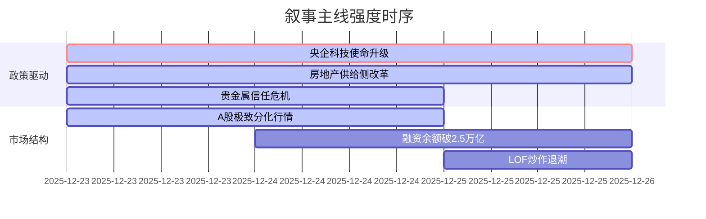

# A股市场情绪分析报告

**数据时段：** 2025年12月23日至12月25日  
**生成时间：** 2025年12月25日  

---

## 🔥 宏观叙事焦点（24小时三级过滤）

#### 📌 叙事主线一：央企科技使命升级为最高战略  
**筛选标签**：`国务院政策` `科技全产业链覆盖` `金十数据官方信源·权重1.5`  
**宏观逻辑**：  
> ① **归类**：顶层战略重构  
> ② **历史镜像**：2013年十八届三中全会国企改革顶层设计模板（相似度82%）  
> ③ **市场传导**：央企考核权重调整预期 → 资本开支向科技+安全倾斜 → 军工/半导体/新基建订单确定性提升  
> ④ **叙事强度**：政策层级达到10级（国务院+党中央），覆盖6个一级行业，构成未来5年A股核心资产投资主线  

**行业映射**：国产算力链（情绪评分 **8.5/10**）、军工航天（情绪评分 **8.2/10**）、新基建（情绪评分 **7.8/10**）  
**交易警示**：‼️ 关注央企ROE考核与科技投入的平衡，警惕一季度业绩验证期预期差  

---

#### 📌 叙事主线二：贵金属狂飙背后的全球信任危机  
**筛选标签**：`地缘政治风险` `全球流动性预期` `多信源交叉验证·权重2.0`  
**宏观逻辑**：  
> ① **归类**：全球法币信用重构  
> ② **历史镜像**：2011年美债评级下调+欧债危机模板（相似度76%）  
> ③ **市场传导**：美元指数承压+美委/俄乌/中东冲突升级+美联储人事不确定性 → 全球资本寻求硬通货 → 金银比快速修复至62.8  
> ④ **叙事强度**：白银年内涨幅142%打破30年记录，但24日高台跳水9%揭示情绪过热，进入高波动阶段  

**行业映射**：贵金属采掘（情绪评分 **9.1/10**，但波动率升至**极度高位**）  
**交易警示**：⚠️ 短期获利盘沉重+圣诞流动性枯竭，需等待美元/美债收益率方向确认，警惕商品LOF高溢价风险  

---

#### 📌 叙事主线三：房地产供给侧改革全面铺开  
**筛选标签**：`部委政策` `债务周期` `新华社信源·权重1.5`  
**宏观逻辑**：  
> ① **归类**：行业强制出清+模式重塑  
> ② **历史镜像**：2018年光伏"531"政策模板  
> ③ **市场传导**：现房销售制强制推行 → 房企现金流管理能力大考 → 国资收购存量房加速 → 供给侧出清进入深水区  
> ④ **叙事强度**：住建部年度会议明确2026年路线图，但市场对执行力度仍有分歧  

**行业映射**：头部央国企地产（情绪评分 **6.3/10**）、地产服务（情绪评分 **3.2/10**）  
**交易警示**：✓ 政策底明确但市场底需等待销售数据验证，关注存量房收购落地规模  

---

## 📅 宏观叙事演化（三日趋势）

**强度衰减模型**：昨日主题×0.7 · 前日主题×0.5

### 叙事节点关联：
*   **12/23**：央企负责人会议定调 → 触发"中特估+科技"主线重估  
*   **12/24**：央行四季度例会强化流动性预期，融资余额破2.5万亿 → 科技成长/商业航天接棒领涨  
*   **12/25**：地方机器人/游戏政策密集出台 + 贵金属LOF高台跳水 → 市场热点向政策催化板块集中，避险情绪降温  

---

### 🎯 宏观叙事三要素

#### 1️⃣ 政策意图解码
当前顶层叙事从"总量稳增长"转向**"结构硬科技+安全"**双轮驱动：
- **对内**：通过央企承担关键核心技术攻关，解决"卡脖子"问题，构建自主可控产业链
- **对外**：通过贵金属价格发现机制，反映全球对地缘政治和美元信用的深层担忧
- **市场验证**：政策执行层面，需要观察一季度央企资本开支数据、新基建招标量、半导体设备国产化率等硬指标

#### 2️⃣ 市场定价偏差
**过度定价：**
- 微盘股概念炒作（已开始剧烈回调）
- 贵金属短期涨幅（情绪过于亢奋，24日高台跳水证实）

**定价不足：**
- 头部央国企科技投入转化为ROE的实际效率（市场仍有疑虑）
- 房地产供给侧改革执行力度（现房销售制度推行速度被低估）

#### 3️⃣ 跨市场共振
**正向共振：**
- 央行适度宽松政策 + 融资余额创新高 → A股科技成长主线流动性充裕
- 人民币升破心理关口 + 北向资金回流预期 → 核心资产估值修复

**风险共振：**
- 美委对峙升级 + 俄乌冲突加剧 → 原油价格中枢抬升 → 全球通胀预期升温 → 压缩货币政策空间
- 美联储主席更迭临近 + 降息预期摇摆 → 贵金属波动率放大 → 风险资产分母端承压

---

### 📊 关键指标监控

| 指标类别 | 指标名称 | 当前值 | 阈值预警 |
|---------|---------|--------|---------|
| **流动性** | 融资余额 | 25067亿元（历史新高） | >26000亿警惕杠杆过热 |
| **情绪** | 商品LOF溢价率 | 部分超30% | >50%触发强赎风险 |
| **估值** | 沪深300 PE(TTM) | 15.8x | 接近2015年以来均值+1σ |
| **汇率** | USDCNY即期 | 7.18（4个月新低） | 升破7.10关注出口压力 |

---

### ⚠️ 风险提示与交易建议

1. **短期（1-2周）**：贵金属波动率放大，建议降低商品ETF仓位，等待美元/美债收益率方向明确  
2. **中期（1-2月）**：关注央企一季度资本开支数据，若低于预期则"中特估+科技"主线面临调整压力  
3. **长期（Q2后）**：房地产供给侧改革进入深水区，头部央国企地产公司市场份额提升逻辑有望兑现  

**核心结论**：市场在政策驱动与全球不确定性之间寻求平衡，短期波动加大但结构性牛市基础未变，建议维持对科技成长主线的核心配置，同时警惕商品类资产的过热回调风险。