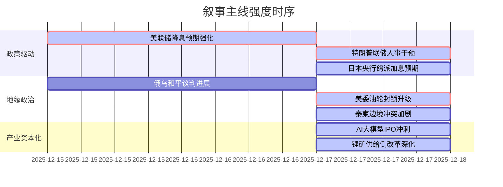

### `A股市场情绪分析报告`
**数据时段：** 2025年12月15日至2025年12月18日  
**生成时间：** 2025年12月18日  

---

### 🔥 宏观叙事焦点（24小时三级过滤）

#### 📌 叙事主线一：全球货币政策转向进入“特朗普预期管理”新阶段 ⭐⭐⭐
**筛选标签**：`联储主席提名` `财政扩张` `特朗普讲话·总统信源`  
**宏观逻辑**：  
> ① **归类**：政策预期与权力交接  
> ② **历史镜像**：2018年特朗普威胁解雇鲍威尔初现端倪，但本次明确人事意图与"大幅降息"政策目标绑定的模式史无前例，更接近1980年代里根-沃尔克博弈的现代版  
> ③ **市场传导**：特朗普预告提名鸽派联储主席 → 美元指数承压 → 离岸人民币升破7.04 → 北向资金risk-on配置中国核心资产（金融、科技）  
> ④ **叙事强度**：打破"央行独立性"传统框架，政治力量深度介入利率路径预期  

**行业映射**：非银金融（政策敏感性溢价，情绪评分 **7.5/10**）、港股科技（流动性预期驱动，情绪评分 **7.8/10**）  
**交易警示**：‼️ 警惕"预期管理的预期"，若联储主席人选落地但政策表态不及"大幅降息"，美元反弹风险将压制A股估值修复  

---

#### 📌 叙事主线二：地缘冲突从"代理人战争"升级为"直接能源博弈" ⭐⭐  
**筛选标签**：`委内瑞拉封锁` `泰柬冲突` `能源制裁` `特朗普指令`  
**宏观逻辑**：  
> ① **归类**：宏观叙事框架重构  
> ② **历史镜像**：1973年石油禁运与2019年特朗普制裁伊朗油轮的混合模板（政策工具modernized with cyber warfare）  
> ③ **市场传导**：特朗普下令全面封锁委油轮 + 委海军护送油船 → 油价利空出尽后反弹+1.6% → 通胀预期升温 → 贵金属突破（现货白银创66美元新高） → A股黄金股联动（山东黄金、赤峰黄金）  
> ④ **叙事强度**：打破"俄乌和平谈判90%共识"的短暂安宁，地缘风险从东欧向拉美+东南亚扩散，供应链扰动风险外溢至A股出口链  

**行业映射**：黄金/贵金属（避险实质性需求，情绪评分 **8.2/10**）、油服设备（预期波动放大，情绪评分 **6.0/10**）  
**交易警示**：⚠️ 地缘冲突脉冲与联储降息叙事形成"风险平价对冲"，谨防油价飙升触发"二次通胀"导致联储政策路径逆转  

---

#### 📌 叙事主线三：AI产业的“国家资本化竞争”全面启动 ⭐  
**筛选标签**：`OpenAI融资` `国产GPU IPO` `AMD访华` `美光财报`  
**宏观逻辑**：  
> ① **归类**：产业生命周期与资本扩张  
> ② **历史镜像**：2000年互联网泡沫期的"战略投资+技术民族主义"与2015年中国半导体国家大基金模板的融合  
> ③ **市场传导**：壁仞/智谱/Minimax密集通过港交所聆讯 → OpenAI寻求亚马逊百亿融资 → 美光财报指引超预期（Q2营收指引183-191亿vs预期143.8亿） → 算力硬件景气验证 → CPO/液冷服务器板块领涨（新易盛、中际旭创）  
> ④ **叙事强度**：AI竞赛从产品迭代进入资本密集投入期，国产算力"自主可控"与全球巨头"联盟对抗"并行  

**行业映射**：AI算力硬件（CPO/服务器，情绪评分 **7.0/10**）、半导体存储（国产替代+全球缺口，情绪评分 **6.5/10**）  
**交易警示**：✓ 资本化加速兑现技术价值，但警惕融资后业绩对赌失败与产能过剩风险（参考2018-2020光伏531政策出清经验）  

---

#### 📌 叙事主线四：中国经济政策的"供给侧改革2.0"深化 ⭐  
**筛选标签**：`宜春锂矿注销` `光伏产能调控` `万科债券展期` `海南封关`  
**宏观逻辑**：  
> ① **归类**：供给侧结构性改革与风险缓释  
> ② **历史镜像**：2016年煤炭"276工作日"去产能模板 + 2021年恒大债务风险处置模式  
> ③ **市场传导**：宜春拟注销27个锂矿采矿权 → 碳酸锂期货涨停+8% → 锂矿股涨停（盛新锂能）；工信部强调光伏落后产能退出 → 强化供给侧出清预期  
> ④ **叙事强度**：政策通过行政手段加速产能退出，以牺牲短期供应弹性换取长期价格稳定与行业健康度  

**行业映射**：锂矿（情绪评分 **7.0/10**）、光伏设备（情绪评分 **5.5/10**）、房地产（风险缓释，情绪评分 **4.5/10**）  
**交易警示**：⚠️ 政策底与市场底背离风险，右侧信号需等待下游需求回暖验证（如新能源汽车销量）  

---

### 📅 宏观叙事演化（三日趋势）

**强度衰减模型**：昨日主题×0.7 · 前日主题×0.5

**叙事节点关联**：  
12/15-16：美国非农"好坏参半"强化降息预期 → A股金融/科技普涨  
12/17：特朗普预告鸽派联储主席提名 → 人民币升值+外资流入，打破市场对"央行独立性"的线性预期  
12/17：美委封锁+柬泰冲突升级 → 贵金属与原油价格同步上涨，地缘风险溢价回归  
12/17：壁仞/智谱/美光三重验证AI景气度 → 算力硬件领涨，产业资本化加速  
12/18：宜春锂矿注销 → 供给侧改革预期强化，政策对商品定价权再显现  

---

### 🎯 宏观叙事三要素

**1️⃣ 政策意图解码**  
当前全球宏观政策从"通胀-就业"二元平衡转向**"国家安全-产业竞争力"**的立体博弈。美欧对乌克兰问题从"军事援助"转向"安全保障框架"以换取俄乌停火，但特朗普在拉美（委内瑞拉）与东南亚（疑似支持泰国）开启新战线，显示其"孤立主义"与"能源民族主义"并存的复杂取向。中国政策则聚焦于**"供给侧改革2.0"**，通过行政手段加速产能出清（锂矿、光伏），以应对全球需求不确定性，同时推进AI/半导体国产替代以争夺下一代技术制高点的资本化窗口。

**2️⃣ 市场定价偏差**  
**过度定价**：  
- 美联储"大幅降息"路径的线性外推（忽略政治干预可能适得其反，引发市场对"财政主导"的恐慌）  
- 地缘冲突脉冲式影响的短期效应（油价/金价快速上涨后的均值回归压力）  

**定价不足**：  
- AI产业资本化加速背后的财务风险（甲骨文100亿美元数据中心融资困境折射巨额capex压力）  
- 中国供给侧改革政策执行力（锂矿/光伏去产能超预期的盈利修复空间）  

**3️⃣ 跨市场共振**  
**美元指数下行 + 人民币升值** → A股核心资产（金融、科技）流动性提升 + 北向资金回流  
**美债收益率下行 + 日本央行潜在加息** → 全球套息交易逆转压力（日元/泰铢式微，加剧亚洲金融风险）  
**AI景气验证 + IPO资本化** → A股算力硬件"全球定价"逻辑强化，分母端（流动性）与分子端（业绩）双击  

---

**总结**：本阶段市场呈现出典型的"叙事混战"特征，**货币政策政治化（特朗普联储人事博弈）**、**地缘冲突扩散化（美委+柬泰双线升级）**与**产业竞争资本化（AI/锂矿供给侧改革）**三股力量交织。A股作为新兴市场估值锚，既受益于美元流动性宽松预期，又受制于地缘供应链扰动与国内政策结构调整的短期阵痛。建议投资者围绕**"流动性敏感+技术自主可控+供给侧受益"**三条主线进行配置，同时警惕美联储政策路径因地缘冲突引发的"二次通胀"而逆转的系统性风险。