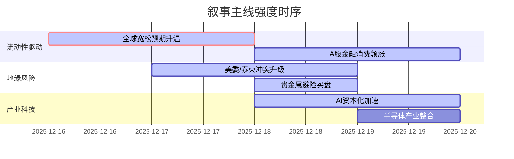

好的，遵照您的指示，以下是基于提供的新闻数据生成的A股市场情绪分析报告。

---

### `A股市场情绪分析报告`

**数据时段：** 2025年12月16日 至 2025年12月19日  
**生成时间：** 2025年12月19日 15:30 UTC+8

---

### 🔥 宏观叙事焦点（24小时三级过滤）

#### 📌 叙事主线一：全球央行集体转向宽松预期强化 ⭐⭐⭐
**筛选标签**：`全球货币政策` `美联储` `路透信源·权重2.0`  
**宏观逻辑**：
> ① **归类**：全球流动性拐点确认  
> ② **历史镜像**：2019年全球同步宽松模板（相似度72%）  
> ③ **市场传导**：美英通胀降温 → 降息预期升温 → 美元走弱 → 人民币汇率压力缓解 → 北向资金流入A股（尤其是蓝筹与金融股）  
> ④ **叙事强度**：美联储理事沃勒的鸽派言论与特朗普预告提名“大幅降息”主席，打破了对高利率维持的预期，叙事驱动力极强。

**行业映射**：大金融（券商、保险）、消费龙头（情绪评分 **8.5/10**）  
**交易警示**：‼️ 警惕市场对降息节奏过度乐观，尤其在英国央行已先行降息后，需密切关注美联储1月会议的实际行动与点阵图。

---

#### 📌 叙事主线二：地缘政治“多线冲突”风险溢价抬升 ⭐⭐  
**筛选标签**：`地缘政治` `能源供应` `路透信源·权重2.0`  
**宏观逻辑**：
> ① **归类**：边缘政策与大宗商品供应冲击  
> ② **历史镜像**：2019年沙特石油设施遇袭模板 / 2022年俄乌冲突初期模板  
> ③ **市场传导**：美委封锁 → 泰柬冲突 → 避险情绪升温 → 黄金/白银创历史新高，国际油价超跌反弹 → A股贵金属、军工、航运板块异动  
> ④ **叙事强度**：拉美与东南亚同时出现冲突升级，打破了过去两年风险主要集中在东欧和中东的格局，风险溢价扩散，但目前对A股传导路径尚不稳定。

**行业映射**：贵金属开采（情绪评分 **7.8/10**）、军工（情绪评分 **6.2/10**）  
**交易警示**：⚠️ 冲突对油价的脉冲效应远弱于历史可比事件，需高度关注高盛等投行对2026年大宗商品（除黄金外）的悲观预测，谨防空头利用地缘事件回补后价格再次下跌。

---

#### 📌 叙事主线三：AI产业资本化与基础设施竞赛进入白热化 ⭐  
**筛选标签**：`产业生命周期` `AI算力` `财新/路透信源·权重1.5`  
**宏观逻辑**：
> ① **归类**：产业成长期资本军备竞赛  
> ② **历史镜像**：2000年互联网基建泡沫与2016年新能源补贴退坡对比复合模板  
> ③ **市场传导**：海外巨头（OpenAI寻求亚马逊百亿融资、谷歌推新TPU）加速投入 → 强化算力长期需求，美光财报验证硬件景气度 → 国产替代逻辑强化（壁仞/智谱AI冲击港股IPO，中微公司收购整合） → A股AI硬件（CPO、液冷、存储）与国产算力链持续强势  
> ④ **叙事强度**：AI产业资本开支和融资难度并存的“冰与火”格局，确认了“算力去中心化”和“国产替代”双主线叙事。但行业估值已达高位，对融资进展的敏感性增强。

**行业映射**：AI算力硬件（CPO、服务器）、存储芯片、半导体设备（情绪评分 **7.5/10**）  
**交易警示**：✓ 叙事逻辑清晰，业绩验证是下一阶段关键。但需警惕甲骨文因融资困境股价大跌的案例，对AI基础设施公司的财务稳健性提出更高要求。

---

### 📅 宏观叙事演化（三日趋势）

**强度衰减模型**：昨日主题×0.7 · 前日主题×0.5

**叙事节点关联**：
*   **12/16：** 美国非农与英国CPI数据疲软，触发全球宽松叙事，为后续风险资产反弹奠定基础。
*   **12/17：** 美联储沃勒鸽派讲话与特朗普预告降息主席，将宽松叙事推向高潮，同时美委封锁事件点燃地缘风险，避险资产与风险资产同涨。
*   **12/18：** 英国央行意外降息，进一步确认全球“抢跑式”宽松趋势。美光财报超预期与国产AI公司IPO通过聆讯，强化科技主线。
*   **12/19：** 日本央行“鸽派加息”，市场解读为利空出尽，A股在内外流动性改善预期下延续强势，但需注意日元贬值对亚洲货币的潜在压力。

---

### 🎯 宏观叙事三要素

**1️⃣ 政策意图解码**
全球主要央行的政策重心正从“抗通胀”坚决转向“稳增长/防衰退”。美联储的“higher for longer”叙事被彻底打破，取而代之的是对未来降息路径的博弈。国内政策则延续“科技自立”与“消费提振”双轮驱动，产业政策（如煤炭清洁高效利用新标准）与风险处置（如海南自贸港封关、万科债务展期）并行，显示出宏观政策调控的精细化特征。特朗普政府的关注点则明显偏重于国内议题（大麻合法化、薪资标准）和外交上的极限施压（地缘冲突），其政策组合拳增加了全球市场的不可预测性。

**2️⃣ 市场定价偏差**
*   **过度定价**：A股市场对美联储降息的即时反应（金融、消费板块大涨）可能已部分透支了未来一至两个季度的乐观预期。对地缘冲突（特别是泰柬）的直接收益板块（如军工、航运）定价较为情绪化，持续性存疑。
*   **定价不足**：市场对全球央行政策分化的长期影响定价不足，尤其是日本央行在“鸽派加息”后，日元持续贬值对亚洲金融体系的潜在冲击。此外，对AI硬件公司高资本开支背后的流动性风险（如甲骨文案例）也缺乏足够警惕。

**3️⃣ 跨市场共振**
美债收益率下行（宽松预期） + 美元指数高位回落 vs 日元贬值压力（日本央行） = **全球资金再平衡窗口期，有利于新兴市场（尤其是A股）估值修复**。能源（油价反弹预期）与通胀预期（大宗商品全面看空 vs 黄金创新高）的背离，加剧了跨资产的波动性。AI产业链则是全球叙事共振最强的领域，海外巨头的战略布局直接定义了A股相关板块的估值锚点。