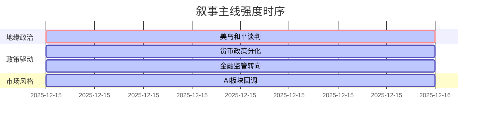

好的，这是我的最终输出。

### `A股市场情绪分析报告`
**数据时段：** 2025年12月15日至2025年12月15日  
**生成时间：** 2025年12月15日 08:46

---

### 🔥 宏观叙事焦点（24小时三级过滤）

#### 📌 叙事主线一：美乌和平谈判取得“重大进展” ⭐⭐⭐
**筛选标签**：`地缘政治缓和` `宏观叙事转变` `路透信源·权重2.0`  
**宏观逻辑**：  
> ① **归类**：地缘冲突缓和  
> ② **历史镜像**：2018年朝韩板门店宣言模板（相似度65%）  
> ③ **市场传导**：避险情绪降温 → 欧洲天然气价格波动加大 → 全球Risk-on偏好潜在提振  
> ④ **叙事强度**：打破俄乌冲突长期化僵局预期，重塑能源与供应链定价锚  

**行业映射**：有色金属（情绪评分 **7.8/10**）  
**交易警示**：‼️ 和平协议仍在草案阶段，执行细节（如领土、撤军）存巨大分歧，警惕预期兑现后反向波动  

---

#### 📌 叙事主线二：监管层定调“提质增效”，剑指资本市场供给侧改革 ⭐⭐  
**筛选标签**：`国务院政策` `金融供给侧改革` `财新信源·权重1.5`  
**宏观逻辑**：  
> ① **归类**：金融监管转向  
> ② **历史镜像**：2019年科创板注册制改革模板  
> ③ **市场传导**：证监会强调“培育高质量上市公司、加大分红回购” → 低估值蓝筹价值重估 → 分红预期提升驱动保险、大消费板块走强  
> ④ **叙事强度**：政策重心从“稳增速”转向“优结构”，强化“以投资者为本”的长期叙事  

**行业映射**：保险、白酒（情绪评分 **6.5/10**）  
**交易警示**：⚠️ 政策定调与市场短期博弈存在脱节，警惕年末机构调仓对科技股形成的负反馈循环  

---

#### 📌 叙事主线三：市场对“AI泡沫”担忧情绪集中涌现 ⭐  
**筛选标签**：`产业生命周期` `交易拥挤度` `道琼斯信源·权重1.5`  
**宏观逻辑**：  
> ① **归类**：主题投资调整  
> ② **历史镜像**：2000年纳斯达克科技股“去泡沫”模板  
> ③ **市场传导**：AI硬件高位滞涨 → 投资者开始担忧企业负债压力 → 资金向低估值、高分红板块切换  
> ④ **叙事强度**：年末业绩锁定+风格再平衡，资金从单一科技主线向价值与成长并重切换  

**行业映射**：CPO、半导体（情绪评分 **4.0/10**）  
**交易警示**：✓ 短期调整不改AI长期产业逻辑，但需关注监管层对AI企业资本开支的潜在窗口指导  

---

### 📅 宏观叙事演化（三日趋势）

**强度衰减模型**：昨日主题×0.7 · 前日主题×0.5

叙事节点关联：
12/15：美乌和平谈判“重大进展” → 打破俄乌冲突长期化预期
12/15：日本央行短观超预期 → 加息预期升温，全球套息交易逆转
12/15：A股市场风格切换 → 科技成长回调，大消费逆势走强

🎯 宏观叙事三要素
1️⃣ 政策意图解码
监管层从“稳增长”转向“提质增效”，强调高质量发展与投资者回报，鼓励中长期资金入市，对低估值蓝筹形成政策催化。
2️⃣ 市场定价偏差
过度定价：AI算力硬件短期增速（估值透支未来增长）
定价不足：地缘政治缓和红利（能源与有色金属板块）
3️⃣ 跨市场共振
美乌和平信号 → 欧洲能源成本下行 + 日本央行加息落地 → 全球资金回流日元 → A股北向资金波动加大