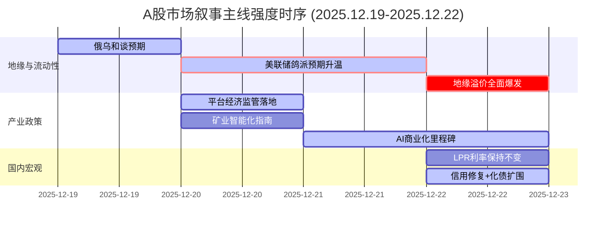

好的，遵照您的指示，我将基于您提供的新闻数据，以A股首席策略师的身份，运用三级过滤机制生成Markdown格式的分析报告。

***

### `A股市场情绪分析报告`

**数据时段：** 2025年12月19日至2025年12月22日  
**生成时间：** 2025年12月22日 19:22

---

### 🔥 宏观叙事焦点（24小时三级过滤）

#### 📌 叙事主线一：地缘溢价飙升，全球进入“避险+宽松预期”共振模式 ⭐⭐⭐
**筛选标签**：`地缘政治` `美联储政策` `路透/财新信源·权重1.5-2.0`

**宏观逻辑**：
> ① **归类**：地缘政治风险定价重构 & 全球流动性预期转向  
> ② **历史镜像**：2022年2月俄乌冲突爆发初期模板（黄金避险+风险资产回调，相似度65%）与2018年Q4美联储加息周期尾声（鸽派预期驱动成长股反弹，相似度58%）的结合体。  
> ③ **市场传导**：美国扣押委内瑞拉油轮（供应冲击）→ 黄金/白银创历史新高（黄金日内破4400美元）→ VIX等恐慌指标未同步飙升 → 风险资产（A股、美股科技）与避险资产同涨。  
> ④ **叙事强度**：地缘突发事件打破了“全球稳步去通胀”的宏观叙事框架，但并未引发系统性恐慌，反而强化了市场对美联储被迫提前/加速降息的押注，形成独特的“避险-宽松”共振。

**A股映射**：
*   **直接受益**：**黄金概念股**（情绪评分 **8.5/10**）。国际金价飙升直接催化A股黄金开采、冶炼企业业绩预期，是当前逻辑最通畅的避险主线。
*   **间接受益**：**科技成长股（半导体、AI）**（情绪评分 **7.0/10**）。全球降息预期升温，有利于长久期资产估值修复。外资（北向资金）流入预期增强，首选仍是科技龙头。

**交易警示**：‼️ **警惕“共振”变“背离”**。当前市场乐观定价了地缘风险倒逼货币宽松的逻辑，但需密切关注：1）美联储官员近期鹰派言论（如哈玛克）与市场预期的背离；2）若地缘冲突意外缓和，或油价未持续暴涨，黄金多头可能面临获利了结压力。

---

#### 📌 叙事主线二：“人工智能+”从政策蓝图进入规模化商用验证期 ⭐⭐
**筛选标签**：`产业政策` `商业化落地` `新华社/官方发布·权重1.5`

**宏观逻辑**：
> ① **归类**：产业生命周期从投入期迈向价值兑现期  
> ② **历史镜像**：2019年5G牌照发放后的应用爆发期模板（从炒基站到炒应用，相似度72%）。  
> ③ **市场传导**：国家AI中试基地投运（产业基础设施完善）→ 长安汽车获全国首个L3级正式号牌（标志性应用落地）→ MiniMax通过港交所聆讯（头部公司启动IPO，提供估值锚）。政策与经济现实形成闭环。  
> ④ **叙事强度**：从中央到地方（如浙江）持续的政策推力，叠加L3自动驾驶等里程碑事件，标志着AI叙事正从“烧钱讲故事”转向“商业化造血”。市场评估标准即将从技术参数转向商业化率和盈利能力。

**行业映射**：
*   **核心受益**：**智能驾驶产业链**（情绪评分 **8.0/10**）。L3牌照是汽车智能化进程中的“iPhone时刻”，直接打通车端感知、决策、执行的软硬件供应商。
*   **生态受益**：**AI算力与基础设施**（情绪评分 **6.5/10**）。随着应用爆发，对算力的需求将持续增长，利好国产GPU（如摩尔线程）、光模块、数据中心等底层硬件。
*   **情绪观察**：**AI应用软件**（情绪评分 **5.8/10**）。虽有长期价值，但短期内面临盈利模式不清晰的考验，需等待标杆性应用出现。

**交易警示**：⚠️ **谨防“证实”与“证伪”的切换**。L3落地是强信号，但需观察后续放量速度和用户付费意愿。MiniMax的估值和市场表现，将成为整个AI赛道的试金石。

---

#### 📌 叙事主线三：宏观政策工具箱精细化，从“总量刺激”转向“靶向修复” ⭐⭐
**筛选标签**：`央行政策` `财政政策` `部委信源·权重1.5`

**宏观逻辑**：
> ① **归类**：宏观政策进入结构性调整与风险拆弹阶段  
> ② **历史镜像**：2014年43号文规范地方债务管理模板（相似度70%），结合2020年疫情期间的普惠金融定向支持。  
> ③ **市场传导**：地方债化债范围扩至“经营性债务”（控风险、拆炸弹）→ 央行“一次性信用修复” （稳消费、修复微观主体）→ 分析师解读“推动投资止跌回稳” （明确财政发力方向）。这是一套“防风险”、“促消费”、“稳投资”的组合拳。  
> ④ **叙事强度**：政策放弃了“大水漫灌”的幻想，转向精准滴灌。对地方债务的系统性治理，虽短期可能抑制地方投资冲动，但长期有助于化解系统性风险。对居民信用的修复，则是为消费复苏培育土壤。整体基调是“先破后立”、“慢药调理”。

**行业映射**：
*   **直接受限**：**传统基建/地方城投平台**（情绪评分 **4.0/10**）。化债范围扩大，意味着传统的“铁公基”和高负债地方国企将面临更严格的融资约束和项目审计。
*   **预期受益**：**新质生产力基建**（情绪评分 **6.2/10**）。“十四五”规划中明确的新能源、数字基建等领域，因其符合国家战略且回报模式更清晰，将成为“止跌回稳”投资的主力军。
*   **长期观察**：**大消费**（情绪评分 **5.0/10**）。信用修复政策是长期利好，但见效缓慢。需结合后续就业和收入数据验证消费复苏的成色。

**交易警示**：✓ **叙事逻辑清晰，等待财政发力验证**。目前市场对此政策组合的理解和定价尚不充分，属于“慢变量”。需密切关注2026年Q1的财政支出数据和专项债发行节奏。

---

### 📅 宏观叙事演化（三日趋势）

**强度衰减模型**：昨日主题×0.7 · 前日主题×0.5

**叙事节点关联**：
*   12/19：俄乌和谈信号初现 → 市场试探性降低避险头寸。
*   12/20：美国通胀数据降温 → 点燃美联储加速降息预期，叙事主线切换至流动性宽松。
*   12/21：AI独角兽IPO + L3牌照落地 → AI产业化逻辑兑现，强化科技成长主线。
*   12/22：美国扣押油轮事件爆发 → 地缘溢价飙升，但未削弱宽松预期，形成“共振”格局。

---
### 🎯 宏观叙事三要素

**1️⃣ 政策意图解码**
当前政策的顶层设计思路是“**在拆弹中前进，在结构调整中寻找新动能**”。对外，地缘政治不确定性成为常态，能源安全和新冷战思维迫使产业链加速重构。对内，放弃对地产和传统基建的路径依赖，通过化解地方债风险来“拆弹”，通过精准修复居民信用来“播种”，同时将未来的增长引擎牢牢锚定在以AI、新能源为代表的“新质生产力”上。政策的定力和精细化程度远超以往。

**2️⃣ 市场定价偏差**
*   **过度定价**：**消费复苏的即刻性**。市场对政策效果的预期过于急切，忽视了资产负债表修复的长期性。耐克在大中华区业绩的“暴雷”是一个微观警示。
*   **定价不足**：**1) 财政发力的强度与方向**。市场对“投资止跌回稳”的理解还停留在传统基建，对新基建的投入规模和增速预期不足。**2) 全球“去宽松”进程的分化风险**。市场正乐观地定价美联储降息，但对日本央行加息后日元套息交易逆转的潜在冲击，以及新美联储主席可能带来的政策变数，定价明显不足。

**3️⃣ 跨市场共振**
*   **正向共振**：美债收益率下行预期 + 美元阶段性走弱 → 打开了中国货币政策的空间，并吸引外资回流新兴市场，A股科技成长股（尤其是港股）迎来流动性窗口期。
*   **负向共振**：全球地缘风险（拉美、中东、东北亚）多点开花 → 油价中枢易涨难跌 → 输入性通胀压力可能卷土重来，这会限制全球央行的宽松步伐，对长久期资产构成潜在威胁。

---