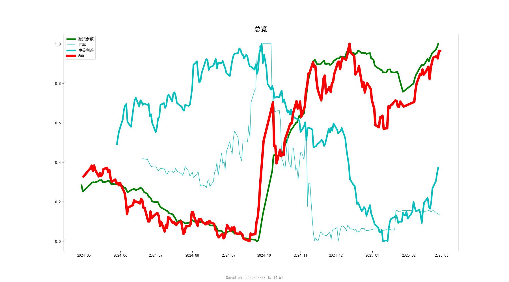

## 恐慌指数

<caption>这是图片 1 的标题。</caption>

## 10债收益率

<caption>这是图片 2 的标题。</caption>

## 标普500

<caption>这是图片 3 的标题。</caption>

## rs2000

<caption>这是图片 4 的标题。</caption>

## 房地产

<caption>这是图片 5 的标题。</caption>

## 东京

<caption>这是图片 6 的标题。</caption>

## 总览

<caption>这是图片 7 的标题。</caption>

## 融资余额

<caption>这是图片 8 的标题。</caption>

## 图片 9

<caption>这是图片 9 的标题。</caption>

## 图片 10

<caption>这是图片 10 的标题。</caption>
