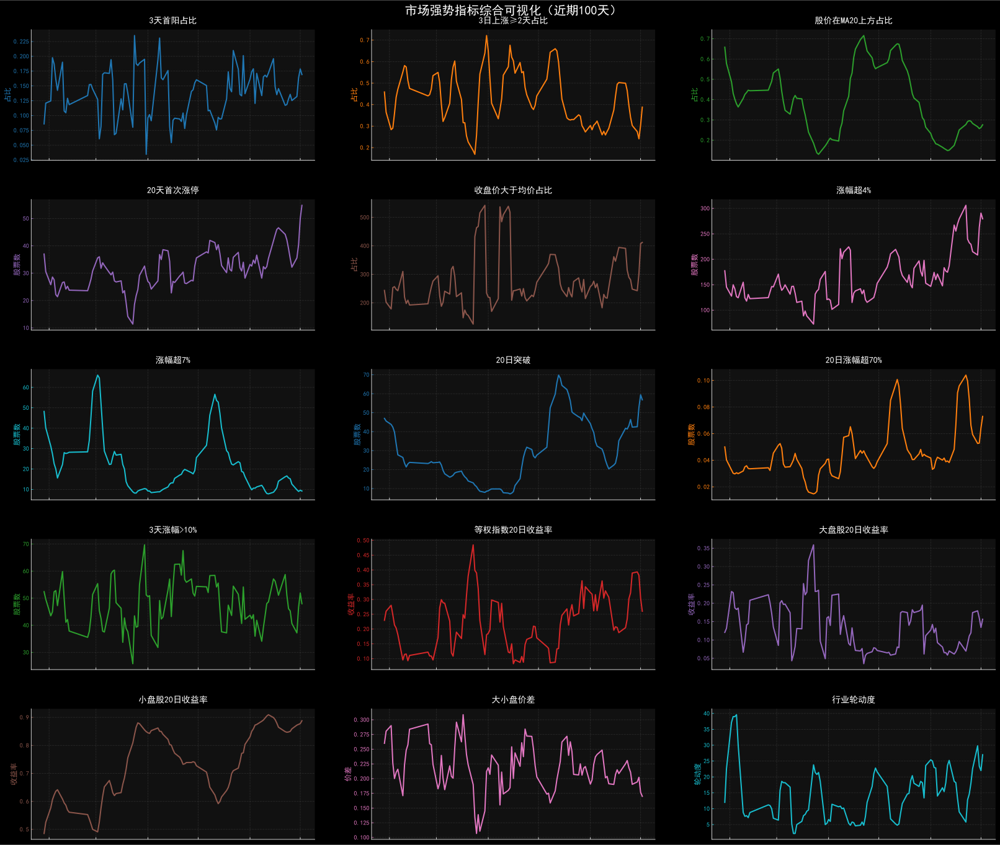
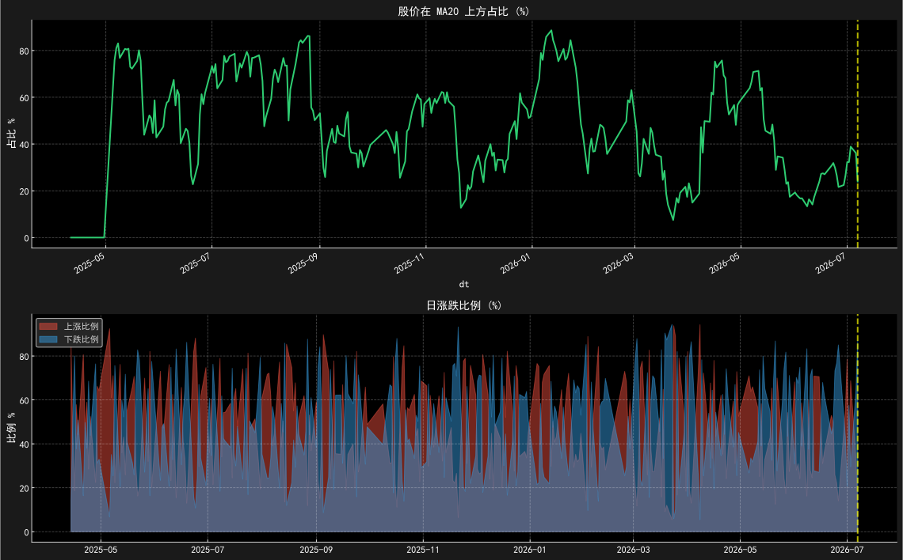
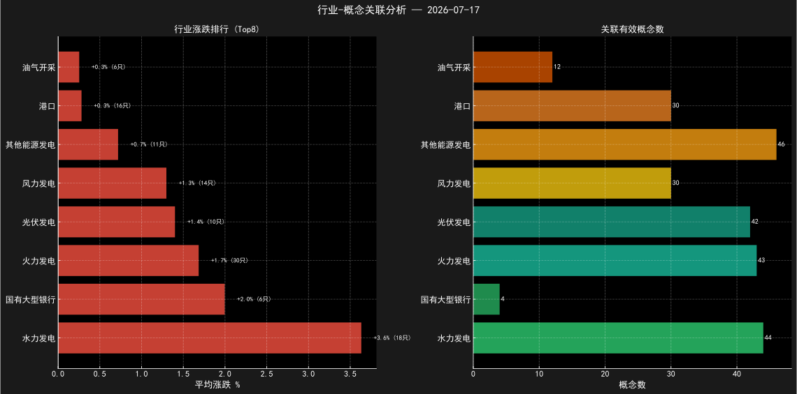
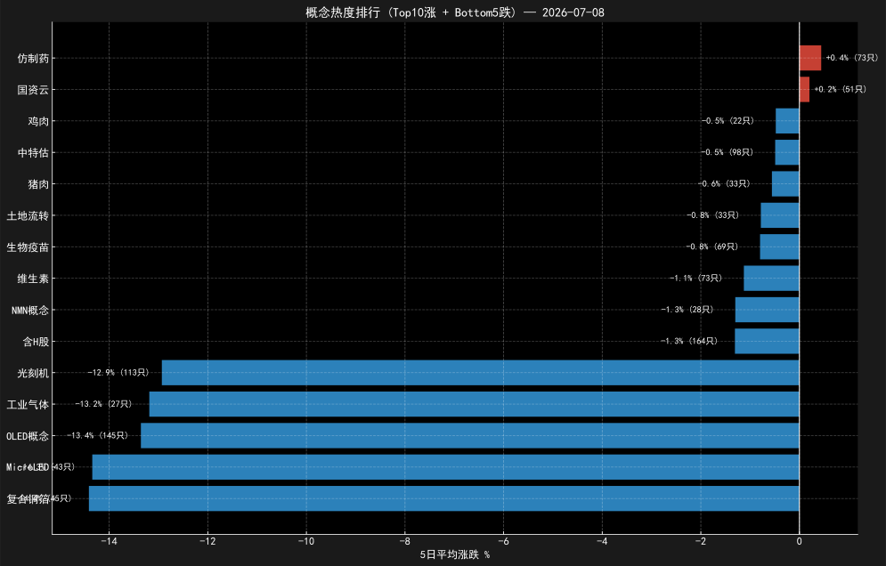
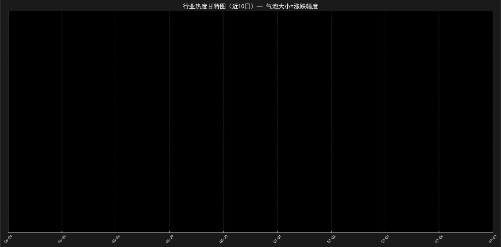

# 市场分析日报 — 2026-07-10

## 报告

- [1. 涨幅分布](output/1-涨幅分布报.md)
- [2. 主升概念](output/2-主升概念报.md)
- [3. 指标AI分析](output/3-走势AI分析报.md)
- [4. 合并解读](output/4-合并解读.md)
- [5. TDX 综合分析](output/5-TDX综合分析报.md)

## 核心图表

---
*Generated by WorkBuddy Pipeline*
