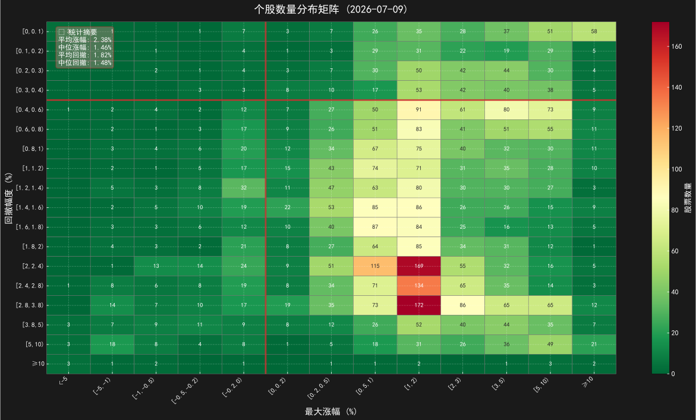
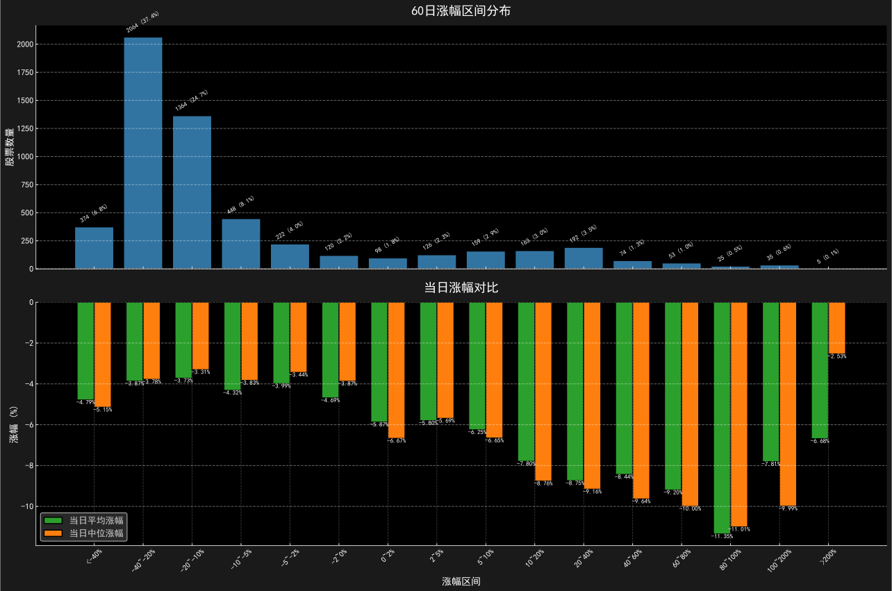
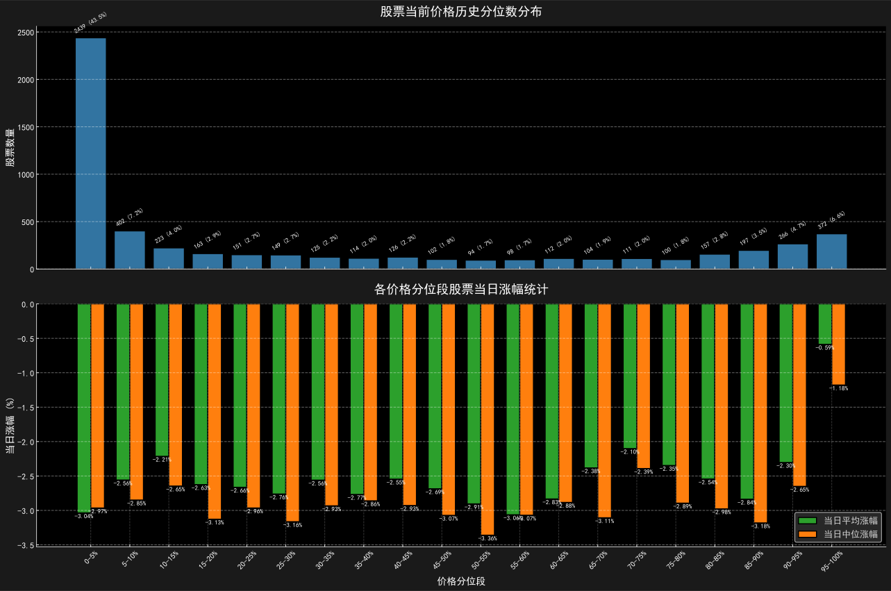
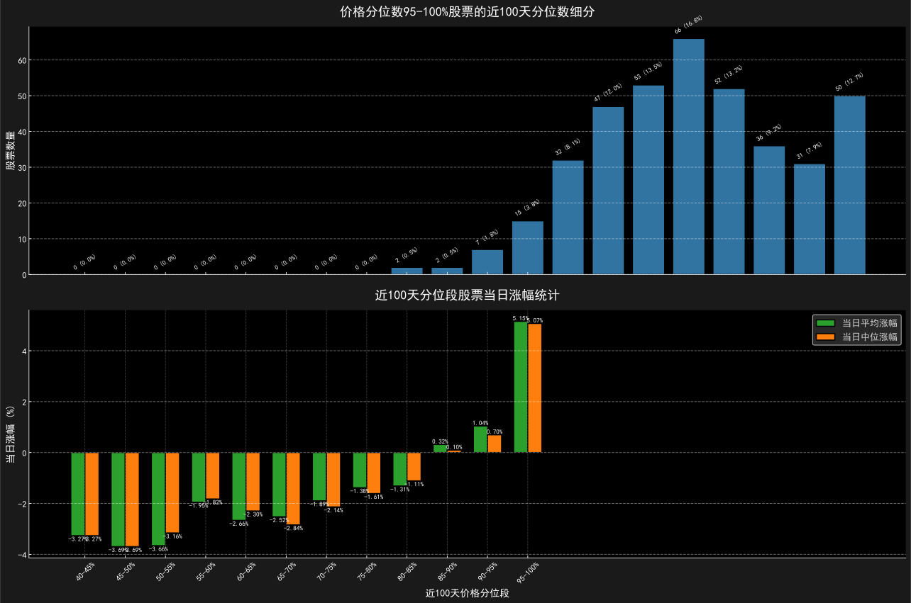
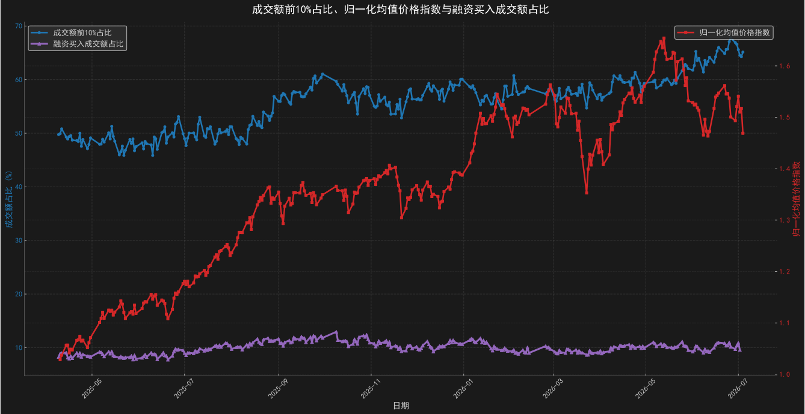

# 市场观察日报

> **报告日期**: 2026年07月15日  
> **生成时间**: 2026-07-15 16:04:37  
> **数据日期**: 2026-07-15

----

## 📊 一、个股数量分布矩阵

### 分析要点

**个股数量分布矩阵分析**:
- 平均涨幅（最高价）：3.12%，中位涨幅（最高价）：2.56%
- 平均涨幅（收盘价）：0.21%，中位涨幅（收盘价）：0.75%
- 平均回撤：2.82%，中位回撤：1.99%
- 分布位置（回撤：[5,10)，涨幅：[3,5)）股票数量最多，共161只
  - 行业分布：化工原料(14只,8.7%)，医疗保健(13只,8.1%)，半导体(12只,7.5%)
- 分布位置（回撤：[5,10)，涨幅：[1,2)）股票数量最多，共158只
  - 行业分布：电气设备(12只,7.6%)，未知(9只,5.7%)，元器件(9只,5.7%)
- 最高涨幅区间（≥10）共155只股票
  - 行业分布：专用机械(17只,11.0%)，元器件(16只,10.3%)，电气设备(9只,5.8%)

**AI深度解读**：
*解读生成失败：AI 服务不可用*

---

## 📈 二、60日涨幅分析

### 2.1 涨幅区间分布

| 涨幅区间 | 数量 | 占比 | 当日平均涨幅 | 当日中位涨幅 |
|:---------:|:----:|:----:|:------------:|:------------:|
| <-40% | 305 | 5.5% | 0.33% | 0.32% |
| -40~-20% | 2154 | 39.0% | 1.05% | 1.15% |
| -20~-10% | 1270 | 23.0% | 1.09% | 1.30% |
| -10~-5% | 403 | 7.3% | 0.56% | 0.90% |
| -5~-2% | 197 | 3.6% | 0.38% | 0.59% |
| -2~0% | 107 | 1.9% | -0.69% | -0.04% |
| 0~2% | 82 | 1.5% | -0.26% | 0.21% |
| 2~5% | 112 | 2.0% | -0.71% | -0.58% |
| 5~10% | 153 | 2.8% | -1.02% | -1.16% |
| 10~20% | 194 | 3.5% | -1.98% | -2.54% |
| 20~40% | 230 | 4.2% | -2.36% | -2.76% |
| 40~60% | 124 | 2.2% | -3.63% | -3.97% |
| 60~80% | 66 | 1.2% | -5.21% | -5.34% |
| 80~100% | 45 | 0.8% | -4.76% | -5.45% |
| 100~200% | 69 | 1.3% | -5.48% | -6.04% |
| >200% | 8 | 0.1% | -5.36% | -4.67% |

**AI深度解读**：
*解读生成失败：AI 服务不可用*

### 2.2 涨幅区间对比分析

**涨幅区间Top4对比分析**:
- 当日平均涨幅Top4区间：-20~-10%, -40~-20%, -10~-5%, -5~-2%，平均涨幅0.77%
- 其余区间平均涨幅：-2.59%，Top4区间高出-129.6%
- 当日中位涨幅Top4区间：-20~-10%, -40~-20%, -10~-5%, -5~-2%，平均涨幅0.99%
- 其余区间中位涨幅：-2.67%，Top4区间高出-136.9%

---

## 💹 三、价格分位数分析

### 3.1 价格分位数分布

| 价格分位段 | 数量 | 占比 | 当日平均涨幅 | 当日中位涨幅 |
|:---------:|:----:|:----:|:------------:|:------------:|
| 0-5% | 2015 | 35.9% | 0.53% | 0.86% |
| 5-10% | 813 | 14.5% | 1.71% | 1.80% |
| 10-15% | 346 | 6.2% | 1.49% | 1.44% |
| 15-20% | 187 | 3.3% | 0.83% | 0.75% |
| 20-25% | 175 | 3.1% | 0.49% | 0.98% |
| 25-30% | 165 | 2.9% | 0.86% | 0.74% |
| 30-35% | 148 | 2.6% | 0.03% | 0.40% |
| 35-40% | 130 | 2.3% | 0.18% | 0.26% |
| 40-45% | 128 | 2.3% | 0.17% | 0.34% |
| 45-50% | 106 | 1.9% | 0.19% | 0.50% |
| 50-55% | 91 | 1.6% | -0.80% | -0.93% |
| 55-60% | 114 | 2.0% | -1.00% | -1.30% |
| 60-65% | 101 | 1.8% | -0.73% | -0.85% |
| 65-70% | 114 | 2.0% | -1.27% | -1.27% |
| 70-75% | 108 | 1.9% | -0.87% | -0.39% |
| 75-80% | 128 | 2.3% | -2.04% | -2.67% |
| 80-85% | 177 | 3.2% | -2.45% | -3.11% |
| 85-90% | 177 | 3.2% | -2.58% | -2.96% |
| 90-95% | 217 | 3.9% | -2.81% | -3.11% |
| 95-100% | 168 | 3.0% | 0.18% | -0.08% |

**AI深度解读**：
*解读生成失败：AI 服务不可用*

### 3.2 价格分位数95-100%股票的近100天分位数细分

| 近100天价格分位段 | 数量 | 占比 | 当日平均涨幅 | 当日中位涨幅 |
|----------------|------|------|------------|------------|
| 0-5% | 0 | 0.0% | 0.00% | 0.00% |
| 5-10% | 0 | 0.0% | 0.00% | 0.00% |
| 10-15% | 0 | 0.0% | 0.00% | 0.00% |
| 15-20% | 0 | 0.0% | 0.00% | 0.00% |
| 20-25% | 0 | 0.0% | 0.00% | 0.00% |
| 25-30% | 0 | 0.0% | 0.00% | 0.00% |
| 30-35% | 0 | 0.0% | 0.00% | 0.00% |
| 35-40% | 0 | 0.0% | 0.00% | 0.00% |
| 40-45% | 2 | 1.1% | -11.04% | -11.04% |
| 45-50% | 2 | 1.1% | -6.61% | -6.61% |
| 50-55% | 5 | 2.8% | -3.30% | -5.63% |
| 55-60% | 8 | 4.5% | -2.87% | -3.97% |
| 60-65% | 13 | 7.3% | -5.66% | -6.22% |
| 65-70% | 15 | 8.4% | -0.93% | -0.37% |
| 70-75% | 21 | 11.7% | -0.55% | 1.00% |
| 75-80% | 29 | 16.2% | -2.70% | -2.75% |
| 80-85% | 23 | 12.8% | -0.15% | -0.10% |
| 85-90% | 16 | 8.9% | -0.07% | -1.06% |
| 90-95% | 12 | 6.7% | 0.42% | -0.87% |
| 95-100% | 33 | 18.4% | 6.83% | 5.55% |

    

**价格分位数95-100%细分Top4对比分析**:
- 当日平均涨幅Top4区间：95-100%, 90-95%, 85-90%, 80-85%，平均涨幅1.76%
- 其余区间平均涨幅：-4.21%，Top4区间高出-141.7%
- 当日中位涨幅Top4区间：95-100%, 70-75%, 80-85%, 65-70%，平均涨幅1.52%
- 其余区间中位涨幅：-4.45%，Top4区间高出-134.2%

---

## 💰 四、成交额与价格分析

### 4.1 成交额集中度与价格指数

**AI深度解读**：
*解读生成失败：AI 服务不可用*

### 4.2 关键指标

**成交额与价格分析**:
- 成交额前10%股票成交额占比：65.41%
- 归一化均值价格指数：1.2589
- 融资买入成交额占比：8.87%

---

*本报告由自动化系统生成，数据仅供参考，不构成投资建议。*
