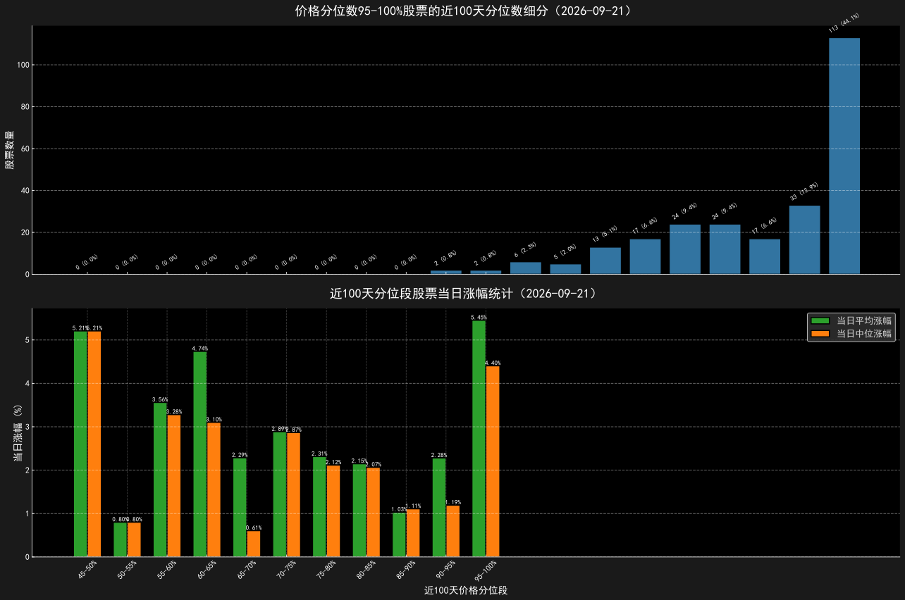

# 市场观察日报

> **报告日期**: 2026年08月24日  
> **生成时间**: 2026-08-24 16:54:03  
> **数据日期**: 2026-08-24

----

## 📊 一、个股数量分布矩阵

### 分析要点

**个股数量分布矩阵分析**:
- 平均涨幅（最高价）：1.62%，中位涨幅（最高价）：1.02%
- 平均涨幅（收盘价）：-1.16%，中位涨幅（收盘价）：-1.20%
- 平均回撤：2.73%，中位回撤：2.40%
- 分布位置（回撤：[2.8,3.8)，涨幅：[1,2)）股票数量最多，共219只
  - 行业分布：电气设备(13只,5.9%)，专用机械(13只,5.9%)，软件服务(11只,5.0%)
- 分布位置（回撤：[2.8,3.8)，涨幅：[0.5,1)）股票数量最多，共179只
  - 行业分布：软件服务(16只,8.9%)，电气设备(15只,8.4%)，专用机械(14只,7.8%)
- 最高涨幅区间（≥10）共70只股票
  - 行业分布：专用机械(9只,12.9%)，电气设备(6只,8.6%)，化工原料(5只,7.1%)

**AI深度解读**：
今天赚钱效应很差，典型的冲高回落闷杀行情。开盘平均冲到**1.62%**，但收盘平均跌了**-1.16%**，回撤平均高达**2.73%**，说明追高的人全被埋了。中位数涨幅收盘也是**-1.20%**，说明不是少数股拖累，而是普遍下跌，市场处于普跌状态。

---

## 📈 二、60日涨幅分析

### 2.1 涨幅区间分布

| 涨幅区间 | 数量 | 占比 | 当日平均涨幅 | 当日中位涨幅 |
|:---------:|:----:|:----:|:------------:|:------------:|
| <-40% | 184 | 3.5% | -1.86% | -2.16% |
| -40~-20% | 1331 | 25.7% | -1.45% | -1.57% |
| -20~-10% | 1306 | 25.2% | -1.02% | -1.11% |
| -10~-5% | 804 | 15.5% | -0.94% | -0.82% |
| -5~-2% | 369 | 7.1% | -0.78% | -0.59% |
| -2~0% | 241 | 4.6% | -0.64% | -0.50% |
| 0~2% | 171 | 3.3% | -0.86% | -0.67% |
| 2~5% | 184 | 3.5% | -0.78% | -0.55% |
| 5~10% | 190 | 3.7% | -0.77% | -0.77% |
| 10~20% | 185 | 3.6% | -1.80% | -1.97% |
| 20~40% | 147 | 2.8% | -2.07% | -2.07% |
| 40~60% | 32 | 0.6% | -1.59% | -3.46% |
| 60~80% | 17 | 0.3% | -2.62% | -3.29% |
| 80~100% | 13 | 0.3% | -3.51% | -4.77% |
| 100~200% | 9 | 0.2% | 0.31% | 0.61% |
| >200% | 1 | 0.0% | -9.88% | -9.88% |

**AI深度解读**：
中期结构偏弱，弱势股扎堆。60日涨幅在-20%以下的股票占了**29.2%**，而涨超20%的强势股只有**7.2%**。更关键的是，前期涨幅最大的股票今天跌得最惨，60日涨超80%的股票今日平均跌幅超**-3.5%**，强势股补跌明显，市场处于震荡下跌阶段，不是趋势行情。

### 2.2 涨幅区间对比分析

**涨幅区间Top4对比分析**:
- 当日平均涨幅Top4区间：100~200%, -2~0%, 5~10%, 2~5%，平均涨幅-0.47%
- 其余区间平均涨幅：-2.36%，Top4区间高出-80.2%
- 当日中位涨幅Top4区间：100~200%, -2~0%, 2~5%, -5~-2%，平均涨幅-0.26%
- 其余区间中位涨幅：-2.70%，Top4区间高出-90.4%

---

## 💹 三、价格分位数分析

### 3.1 价格分位数分布

| 价格分位段 | 数量 | 占比 | 当日平均涨幅 | 当日中位涨幅 |
|:---------:|:----:|:----:|:------------:|:------------:|
| 0-5% | 825 | 15.7% | -1.85% | -1.68% |
| 5-10% | 930 | 17.7% | -1.07% | -1.06% |
| 10-15% | 791 | 15.1% | -0.90% | -0.83% |
| 15-20% | 457 | 8.7% | -0.48% | -0.60% |
| 20-25% | 249 | 4.7% | -0.46% | -0.63% |
| 25-30% | 183 | 3.5% | -0.96% | -1.02% |
| 30-35% | 129 | 2.5% | -0.92% | -0.88% |
| 35-40% | 119 | 2.3% | -1.45% | -1.54% |
| 40-45% | 120 | 2.3% | -1.52% | -1.49% |
| 45-50% | 126 | 2.4% | -1.00% | -1.23% |
| 50-55% | 109 | 2.1% | -1.79% | -1.95% |
| 55-60% | 119 | 2.3% | -1.51% | -1.53% |
| 60-65% | 124 | 2.4% | -1.47% | -1.66% |
| 65-70% | 119 | 2.3% | -1.38% | -1.37% |
| 70-75% | 148 | 2.8% | -1.49% | -1.69% |
| 75-80% | 177 | 3.4% | -1.72% | -1.97% |
| 80-85% | 152 | 2.9% | -2.06% | -2.56% |
| 85-90% | 135 | 2.6% | -1.19% | -1.59% |
| 90-95% | 107 | 2.0% | -1.52% | -1.52% |
| 95-100% | 127 | 2.4% | 1.01% | 0.29% |

**AI深度解读**：
资金明显在抱团最强势的股票，但整体风险偏好很低。价格分位数**95-100%**的高位股今天平均还是涨了**1.01%**，而其他分位段全部下跌，尤其低位股（0-5%分位）跌了**-1.85%**。高位股内部也分化，只有最顶尖的**95-100%**细分在涨，说明资金只敢在少数龙头里抱团取暖。

### 3.2 价格分位数95-100%股票的近100天分位数细分

| 近100天价格分位段 | 数量 | 占比 | 当日平均涨幅 | 当日中位涨幅 |
|----------------|------|------|------------|------------|
| 0-5% | 0 | 0.0% | 0.00% | 0.00% |
| 5-10% | 0 | 0.0% | 0.00% | 0.00% |
| 10-15% | 0 | 0.0% | 0.00% | 0.00% |
| 15-20% | 0 | 0.0% | 0.00% | 0.00% |
| 20-25% | 0 | 0.0% | 0.00% | 0.00% |
| 25-30% | 0 | 0.0% | 0.00% | 0.00% |
| 30-35% | 0 | 0.0% | 0.00% | 0.00% |
| 35-40% | 0 | 0.0% | 0.00% | 0.00% |
| 40-45% | 1 | 0.8% | 4.57% | 4.57% |
| 45-50% | 0 | 0.0% | 0.00% | 0.00% |
| 50-55% | 0 | 0.0% | 0.00% | 0.00% |
| 55-60% | 2 | 1.5% | -3.34% | -3.34% |
| 60-65% | 10 | 7.5% | -2.40% | -1.64% |
| 65-70% | 7 | 5.3% | -0.59% | -1.40% |
| 70-75% | 15 | 11.3% | -1.85% | -2.02% |
| 75-80% | 15 | 11.3% | -1.10% | -1.25% |
| 80-85% | 18 | 13.5% | 0.96% | -0.13% |
| 85-90% | 14 | 10.5% | -1.24% | -2.10% |
| 90-95% | 11 | 8.3% | 1.09% | 0.84% |
| 95-100% | 40 | 30.1% | 4.64% | 2.45% |

    

**价格分位数95-100%细分Top4对比分析**:
- 当日平均涨幅Top4区间：95-100%, 40-45%, 90-95%, 80-85%，平均涨幅2.81%
- 其余区间平均涨幅：-1.75%，Top4区间高出-260.7%
- 当日中位涨幅Top4区间：40-45%, 95-100%, 90-95%, 80-85%，平均涨幅1.93%
- 其余区间中位涨幅：-1.96%，Top4区间高出-198.7%

---

## 💰 四、成交额与价格分析

### 4.1 成交额集中度与价格指数

**AI深度解读**：
成交额高度集中，前10%股票占了**62.18%**，但价量配合很差。归一化价格指数**1.1840**处于高位，但整体市场下跌，说明集中度是资金在少数股票里对倒，而非增量入场。融资买入占比**8.97%**不算高，杠杆情绪不亢奋，资金面不支持整体上涨。

### 4.2 关键指标

**成交额与价格分析**:
- 成交额前10%股票成交额占比：62.18%
- 归一化均值价格指数：1.1840
- 融资买入成交额占比：8.97%

---

*本报告由自动化系统生成，数据仅供参考，不构成投资建议。*
