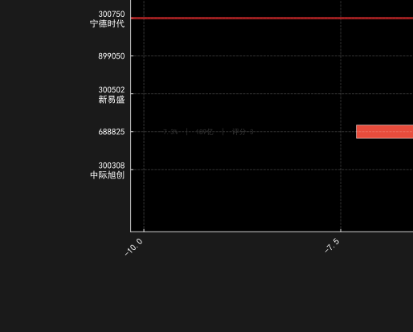
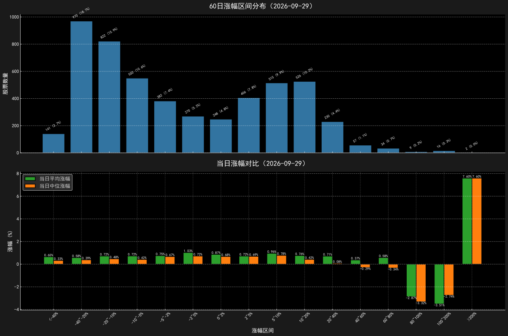
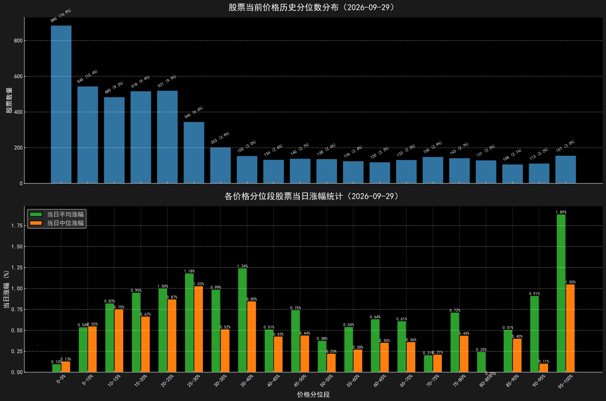
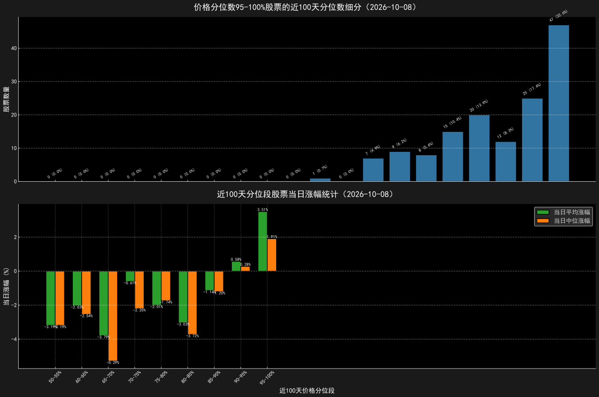
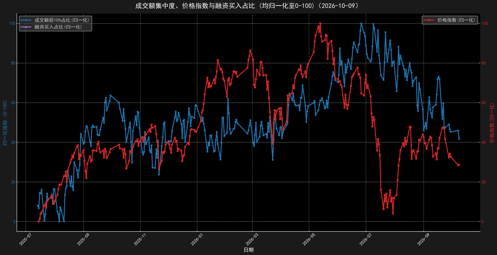

# 市场观察日报

> **报告日期**: 2026年09月28日  
> **生成时间**: 2026-09-29 08:58:14  
> **数据日期**: 2026-09-28

----

## 📊 一、个股数量分布矩阵

### 分析要点

**个股数量分布矩阵分析**:
- 平均涨幅（最高价）：1.12%，中位涨幅（最高价）：0.67%
- 平均涨幅（收盘价）：-2.23%，中位涨幅（收盘价）：-1.83%
- 平均回撤：3.32%，中位回撤：2.70%
- 分布位置（回撤：[2.8,3.8)，涨幅：[1,2)）股票数量最多，共161只
  - 行业分布：汽车配件(11只,6.8%)，电气设备(10只,6.2%)，化工原料(9只,5.6%)
- 分布位置（回撤：[2.8,3.8)，涨幅：[0.5,1)）股票数量最多，共157只
  - 行业分布：专用机械(13只,8.3%)，软件服务(11只,7.0%)，汽车配件(9只,5.7%)
- 最高涨幅区间（≥10）共45只股票
  - 行业分布：区域地产(4只,8.9%)，软件服务(3只,6.7%)，元器件(3只,6.7%)

**AI深度解读**：
*解读生成失败：AI 服务不可用*

---

## 📈 二、60日涨幅分析

### 2.1 涨幅区间分布

| 涨幅区间 | 数量 | 占比 | 当日平均涨幅 | 当日中位涨幅 |
|:---------:|:----:|:----:|:------------:|:------------:|
| <-40% | 101 | 2.0% | -5.47% | -5.69% |
| -40~-20% | 812 | 15.7% | -4.18% | -3.95% |
| -20~-10% | 701 | 13.5% | -3.03% | -2.69% |
| -10~-5% | 547 | 10.6% | -2.23% | -1.98% |
| -5~-2% | 354 | 6.8% | -1.68% | -1.36% |
| -2~0% | 242 | 4.7% | -1.33% | -1.13% |
| 0~2% | 270 | 5.2% | -1.46% | -1.16% |
| 2~5% | 394 | 7.6% | -1.10% | -0.86% |
| 5~10% | 603 | 11.6% | -0.85% | -0.77% |
| 10~20% | 697 | 13.5% | -1.30% | -0.99% |
| 20~40% | 309 | 6.0% | -1.88% | -1.98% |
| 40~60% | 82 | 1.6% | -2.47% | -2.06% |
| 60~80% | 26 | 0.5% | -4.20% | -3.44% |
| 80~100% | 19 | 0.4% | -5.94% | -6.07% |
| 100~200% | 17 | 0.3% | -4.41% | -4.14% |
| >200% | 5 | 0.1% | -4.67% | -10.00% |

**AI深度解读**：
*解读生成失败：AI 服务不可用*

### 2.2 涨幅区间对比分析

**涨幅区间Top4对比分析**:
- 当日平均涨幅Top4区间：5~10%, 2~5%, 10~20%, -2~0%，平均涨幅-1.15%
- 其余区间平均涨幅：-3.47%，Top4区间高出-67.0%
- 当日中位涨幅Top4区间：5~10%, 2~5%, 10~20%, -2~0%，平均涨幅-0.93%
- 其余区间中位涨幅：-3.71%，Top4区间高出-74.8%

---

## 💹 三、价格分位数分析

### 3.1 价格分位数分布

| 价格分位段 | 数量 | 占比 | 当日平均涨幅 | 当日中位涨幅 |
|:---------:|:----:|:----:|:------------:|:------------:|
| 0-5% | 1035 | 19.7% | -2.19% | -1.85% |
| 5-10% | 584 | 11.1% | -1.92% | -1.57% |
| 10-15% | 507 | 9.7% | -1.79% | -1.52% |
| 15-20% | 514 | 9.8% | -1.40% | -1.14% |
| 20-25% | 475 | 9.0% | -1.14% | -0.90% |
| 25-30% | 269 | 5.1% | -0.93% | -0.86% |
| 30-35% | 179 | 3.4% | -1.98% | -1.91% |
| 35-40% | 149 | 2.8% | -2.57% | -2.43% |
| 40-45% | 134 | 2.6% | -2.63% | -2.65% |
| 45-50% | 135 | 2.6% | -3.18% | -3.15% |
| 50-55% | 119 | 2.3% | -2.87% | -2.63% |
| 55-60% | 128 | 2.4% | -3.06% | -3.10% |
| 60-65% | 108 | 2.1% | -4.07% | -3.87% |
| 65-70% | 147 | 2.8% | -4.45% | -4.20% |
| 70-75% | 132 | 2.5% | -3.97% | -4.14% |
| 75-80% | 142 | 2.7% | -3.96% | -4.40% |
| 80-85% | 125 | 2.4% | -3.83% | -3.92% |
| 85-90% | 107 | 2.0% | -3.66% | -3.55% |
| 90-95% | 111 | 2.1% | -2.24% | -2.21% |
| 95-100% | 152 | 2.9% | -2.42% | -2.30% |

**AI深度解读**：
*解读生成失败：AI 服务不可用*

### 3.2 价格分位数95-100%股票的近100天分位数细分

| 近100天价格分位段 | 数量 | 占比 | 当日平均涨幅 | 当日中位涨幅 |
|----------------|------|------|------------|------------|
| 0-5% | 0 | 0.0% | 0.00% | 0.00% |
| 5-10% | 0 | 0.0% | 0.00% | 0.00% |
| 10-15% | 0 | 0.0% | 0.00% | 0.00% |
| 15-20% | 0 | 0.0% | 0.00% | 0.00% |
| 20-25% | 0 | 0.0% | 0.00% | 0.00% |
| 25-30% | 0 | 0.0% | 0.00% | 0.00% |
| 30-35% | 0 | 0.0% | 0.00% | 0.00% |
| 35-40% | 0 | 0.0% | 0.00% | 0.00% |
| 40-45% | 0 | 0.0% | 0.00% | 0.00% |
| 45-50% | 0 | 0.0% | 0.00% | 0.00% |
| 50-55% | 1 | 0.6% | -1.85% | -1.85% |
| 55-60% | 2 | 1.3% | 0.63% | 0.63% |
| 60-65% | 3 | 1.9% | -8.36% | -5.98% |
| 65-70% | 5 | 3.1% | -5.96% | -6.91% |
| 70-75% | 12 | 7.5% | -9.23% | -9.98% |
| 75-80% | 25 | 15.7% | -4.61% | -4.09% |
| 80-85% | 32 | 20.1% | -4.35% | -4.60% |
| 85-90% | 25 | 15.7% | -1.69% | -1.15% |
| 90-95% | 20 | 12.6% | -1.43% | -1.01% |
| 95-100% | 34 | 21.4% | 2.81% | 1.90% |

    

**价格分位数95-100%细分Top4对比分析**:
- 当日平均涨幅Top4区间：95-100%, 55-60%, 90-95%, 85-90%，平均涨幅0.08%
- 其余区间平均涨幅：-5.73%，Top4区间高出-101.4%
- 当日中位涨幅Top4区间：95-100%, 55-60%, 90-95%, 85-90%，平均涨幅0.09%
- 其余区间中位涨幅：-5.57%，Top4区间高出-101.7%

---

## 💰 四、成交额与价格分析

### 4.1 成交额集中度与价格指数

**AI深度解读**：
*解读生成失败：AI 服务不可用*

### 4.2 关键指标

**成交额与价格分析**:
- 成交额前10%股票成交额占比：57.38%
- 归一化均值价格指数：1.1174
- 融资买入成交额占比：8.06%

---

*本报告由自动化系统生成，数据仅供参考，不构成投资建议。*
