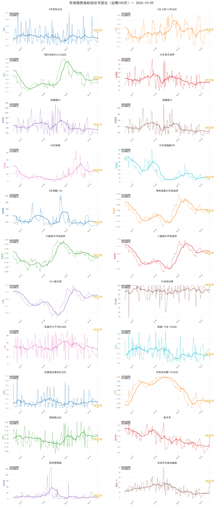

# 市场指标AI分析报告

## 一、指标说明
共分析了 22 个市场指标，分为以下几类：

### 1. 市场情绪指标（3个）
- 3天首阳占比：3天内首次上涨的股票比例，反映市场短期情绪
- 3日上涨≥2天占比：3天内至少2天上涨的股票比例，反映市场持续性
- 股价在MA20上方占比：股价位于20日均线之上的股票比例，反映中期趋势

### 2. 活跃度指标（2个）
- 20天首次涨停：20天内首次涨停的股票数量，反映市场活跃度
- 收盘价大于均价占比：全部股票中收盘价大于均价（成交额/成交量）的股票数量占比，反映市场资金流向

### 3. 涨幅指标（5个）
- 涨幅超4%：单日涨幅超过4%的股票数量
- 涨幅超7%：单日涨幅超过7%的股票数量
- 60日突破：突破60日高点的股票数量
- 20日涨幅超70%：20日累计涨幅超过70%的股票数量
- 3天涨幅>10%：3日累计涨幅超过10%的股票数量

### 4. 下跌指标（4个）
- 跌幅-7%至-2%占比：跌幅在-7%至-2%之间的股票比例
- 收盘接近最低价占比：收盘价与当日最低价之差不足振幅10%的股票比例
- 自高点回撤>10%占比：收盘价自高点回撤超过10%的股票比例
- 微跌股占比：跌幅介于-2%至-0.5%的股票比例

### 5. 交易指标（3个）
- 换手率：全市场平均换手率%（仅从此处移到独立分类）
- 跌停股票数：跌停股票数量
- 市场平均波动幅度：全市场 ((H-O)+(H-L)+(C-L))/prev_C 的截面对均值 (%)，反映日多空博弈活跃度

**分析目的**：当日新出现多个转折点时，可以相互印证3日上涨≥2天占比的走向

## 二、转折点重合度分析
以下是基于转折点重合度和皮尔逊相关系数的指标对分析（重合度 > 0.3 或 abs（皮尔逊相关系数）> 0.5）：

**相关性分析汇总**：

- **总指标对数**: 120 对
- **符合条件指标对数**: 53 对（重合度 > 0.3 或 abs（皮尔逊相关系数）> 0.5）

**按相关强度分类**：
- 弱相关: 24 对
- 中等相关: 22 对
- 强相关: 5 对
- 极强相关: 2 对

**按相关方向分类**：
- 正相关（同向变化）: 26 对
- 负相关（反向变化）: 26 对
- 中性相关: 1 对

**重点关注：与'3日上涨≥2天占比'相关的指标对**（共 5 对）：

- 3天首阳占比 ↔ 3日上涨≥2天占比: 重合度=0.184, 相关系数=-0.558, 方向=中性相关
- 3日上涨≥2天占比 ↔ 股价在MA20上方占比: 重合度=0.130, 相关系数=0.517, 方向=正相关（同向变化）
- 3日上涨≥2天占比 ↔ 3天涨幅>10%: 重合度=0.265, 相关系数=0.561, 方向=正相关（同向变化）
- 3日上涨≥2天占比 ↔ 收盘价大于均价占比: 重合度=0.266, 相关系数=0.532, 方向=正相关（同向变化）
- 3日上涨≥2天占比 ↔ 跌幅-7%至-2%占比: 重合度=0.230, 相关系数=-0.650, 方向=负相关（反向变化）

## 三、市场指标可视化

---

## 四、趋势与转折点分析

生成时间: 2026-10-08 16:59:06

### 1. 关键转折点识别

最近2个交易日出现重要转折点的指标：

最近30天内未检测到重要转折点。

### 2. 趋势分析

按类别分析各指标的趋势状态（相对历史位置）：

**说明**：
- **趋势强度**：基于线性回归的R²值（决定系数），范围0-100%，数值越大表示趋势越稳定可靠
- **相对位置**：基于历史转折点值计算的分位数（转折点数量≥3时），显示当前值在转折点值区间中的位置；若转折点数量不足，则基于全部历史数据计算

#### 市场情绪指标

**3天首阳占比**

- 最新值: 0.1590
- 相对位置: 🟡 历史中位（300天，62%分位，157个转折点）
- 短期趋势: 上升 (强度: 84.02%)
**3日上涨≥2天占比**

- 最新值: 0.2723
- 相对位置: 🔵 历史低位（300天，7%分位，79个转折点）
- 短期趋势: 下降 (强度: 94.36%)
**股价在MA20上方占比**

- 最新值: 0.3297
- 相对位置: 🟢 历史中低位（300天，24%分位，57个转折点）
- 短期趋势: 下降 (强度: 99.12%)
**20天首次涨停**

- 最新值: 22.0000
- 相对位置: 🔵 历史低位（300天，9%分位，142个转折点）
- 短期趋势: 下降 (强度: 68.96%)
#### 涨幅指标

**涨幅超4%**

- 最新值: 197.0000
- 相对位置: 🔵 历史低位（300天，0%分位，140个转折点）
- 短期趋势: 下降 (强度: 88.17%)
**涨幅超7%**

- 最新值: 79.2000
- 相对位置: 🔵 历史低位（300天，3%分位，137个转折点）
- 短期趋势: 下降 (强度: 89.68%)
**60日突破**

- 最新值: 23.2000
- 相对位置: 🟢 历史中低位（300天，22%分位，75个转折点）
- 短期趋势: 下降 (强度: 96.15%)
**20日涨幅超70%**

- 最新值: 9.8000
- 相对位置: 🔵 历史低位（300天，7%分位，69个转折点）
- 短期趋势: 下降 (强度: 85.58%)
**3天涨幅>10%**

- 最新值: 86.0000
- 相对位置: 🔵 历史低位（300天，0%分位，79个转折点）
- 短期趋势: 下降 (强度: 98.96%)
#### 收益率指标

#### 行业指标

#### 下跌指标

**跌幅-7%至-2%占比**

- 最新值: 0.2480
- 相对位置: 🟡 历史中位（300天，56%分位，127个转折点）
- 短期趋势: 上升 (强度: 81.84%)
**收盘接近最低价占比**

- 最新值: 0.1908
- 相对位置: 🟡 历史中位（300天，57%分位，141个转折点）
- 短期趋势: 上升 (强度: 50.80%)
**自高点回撤>10%占比**

- 最新值: 0.6841
- 相对位置: 🟡 历史中位（300天，63%分位，68个转折点）
- 短期趋势: 上升 (强度: 99.28%)
**微跌股占比**

- 最新值: 0.2624
- 相对位置: 🟡 历史中高位（300天，70%分位，138个转折点）
- 短期趋势: 上升 (强度: 19.43%)
#### 交易指标

**跌停股票数**

- 最新值: 23.0000
- 相对位置: 🔵 历史低位（300天，17%分位，123个转折点）
- 短期趋势: 上升 (强度: 67.57%)
**市场平均波动幅度**

- 最新值: 7.3827
- 相对位置: 🔵 历史低位（300天，17%分位，141个转折点）
- 短期趋势: 下降 (强度: 16.71%)

---

## 五、AI深度分析

AI分析失败：无法获取免费模型或分析超时。

建议：
1. 检查网络连接是否正常
2. 稍后重试分析
3. 手动查看指标数据和转折点分析结果
