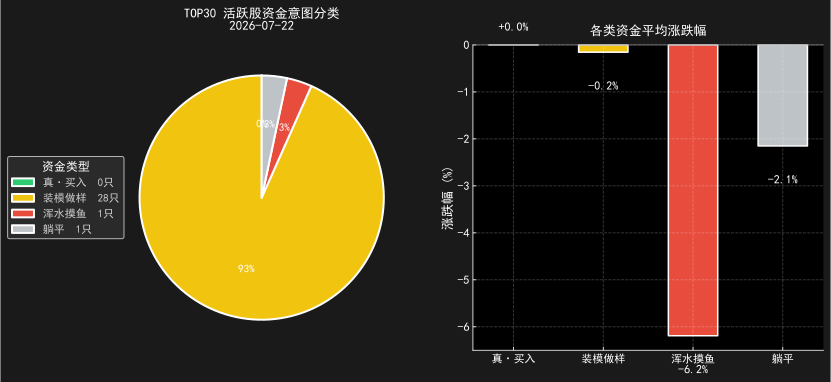
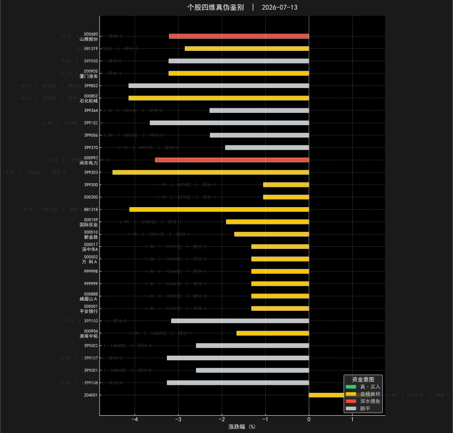
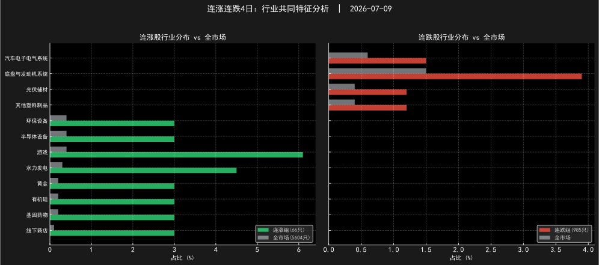

# TDX 综合分析报告 - 2026-07-13

数据日期: 2026-07-13

## 一、市场概览
全市场5,604只A股中，上涨897只、下跌4,651只。全市场平均涨跌幅-3.5%，中位数-3.7%。
强势股（涨超5%）111只，弱势股（跌超5%）1939只。涨停27只，跌停257只。
总成交额28585亿元，头部10%个股占据66.2%成交额。
宽度变化：近2日上涨家数减少4402.0只（前日5,756.0→当日1,354.0），均衡 (多空胶着)。

## 二、行业与概念热点
领涨: 辅料(+3.4%)、国有大型银行(+2.8%)、城商行(+2.3%) | 领跌: 有机硅(-8.6%)、磨具磨料(-8.3%)、发行院线(-8.2%)
热门概念: 仿制药(+0.8%)、肝炎概念(+0.5%)、减肥药(+0.1%)

## 三、资金面分析
融资3360亿 | 龙虎榜机构今日买入10只

## 四、持续性与结构特征
连涨3日以上股票110只(占全市场2.0%)，其中主升浪级别(中及以上)58只（超强3只、强13只）。连跌3日以上362只。 连涨股增加45只 | 连跌股增加42只 | 主升浪增加11只 | 新出现连涨行业：云基础设施服务、粮油加工、城商行 | 消失的连涨行业：黄金、线下药店、基因药物 | 新出现连跌行业：锂电池、其他化学制品
连涨股行业偏好：粮油加工(浓缩13.7倍)、云基础设施服务(浓缩12.2倍)、水力发电(浓缩12.2倍)
连跌股集中在：锂(浓缩13.9倍)、电池化学品(浓缩8.1倍)、其他金属新材料(浓缩7.0倍)

## 五、资本行为质量
成交额TOP30活跃股中，真实买入0只、装模做样17只、浑水摸鱼2只、躺平11只。
市场偏虚 — 活跃股中虚假信号占主导，警惕诱多/诱空陷阱

## 六、综合研判
但活跃股信号偏虚。明日预测看涨
结构性机会：连涨股集中于粮油加工等上游制造方向，回避锂等下行行业。

