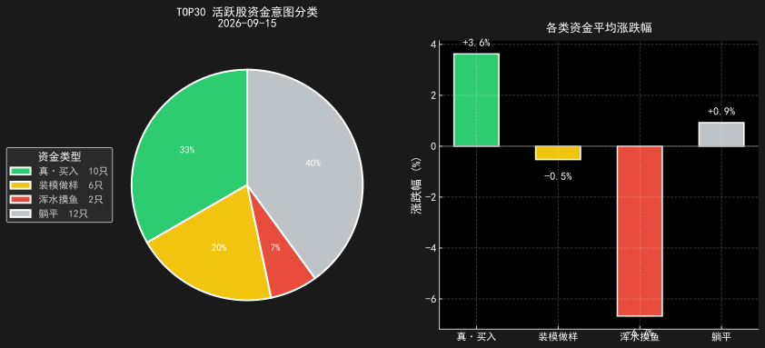
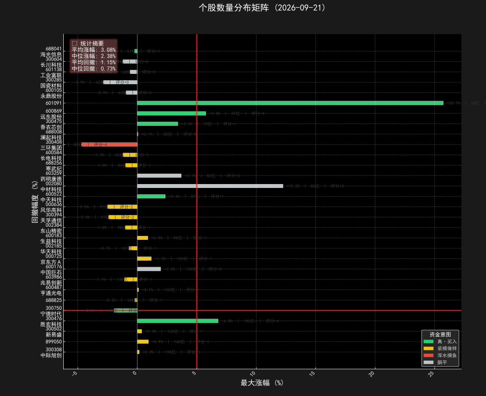
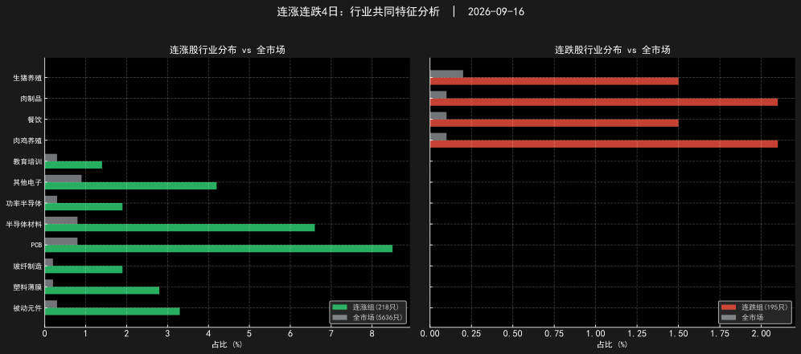

# TDX 综合分析报告 - 2026-08-05

数据日期: 2026-08-05

## 一、市场概览
全市场5,612只A股中，上涨3,804只、下跌1,630只。全市场平均涨跌幅+1.9%，中位数+1.0%。
强势股（涨超5%）814只，弱势股（跌超5%）9只。涨停186只，跌停0只。
总成交额27061亿元，头部10%个股占据66.6%成交额。
宽度变化：近2日上涨家数增加961.0只（前日5,766.0→当日6,727.0），强势 (近3日上涨/下跌比>2)。

## 二、行业与概念热点
领涨: 镍(+11.6%)、产联网综合服务(+9.4%)、光纤光缆(+9.4%) | 领跌: 股份制银行(-1.6%)、国有大型银行(-1.4%)、农商行(-1.3%)
热门概念: CPO概念(+7.0%)、先进封装(+6.4%)、存储芯片(+6.3%)

## 三、资金面分析
融资7313亿 | 龙虎榜机构今日买入10只

## 四、持续性与结构特征
连涨3日以上股票390只(占全市场7.1%)，其中主升浪级别(中及以上)154只（超强6只、强17只）。连跌3日以上12只。 连涨股减少775只 | 连跌股减少286只 | 主升浪减少240只 | 新出现连涨行业：互联网广告、游戏、通信终端及配件 | 消失的连涨行业：城商行、基建工程、农药 | 新出现连跌行业：其他生物制药、检测服务、集成电路设计
连涨股行业偏好：互联网广告(浓缩4.4倍)、游戏(浓缩4.3倍)、通信终端及配件(浓缩3.9倍)
连跌股集中在：铁矿石(浓缩83.3倍)、磨具磨料(浓缩45.7倍)、其他生物制药(浓缩29.6倍)

## 五、资本行为质量
成交额TOP30活跃股中，真实买入23只、装模做样4只、浑水摸鱼0只、躺平3只。
市场偏强 — 活跃股中真实买入占主导，赚钱效应可信度高

## 六、综合研判
且活跃股信号可信。明日预测看涨
结构性机会：连涨股集中于互联网广告等上游制造方向，回避铁矿石等下行行业。

