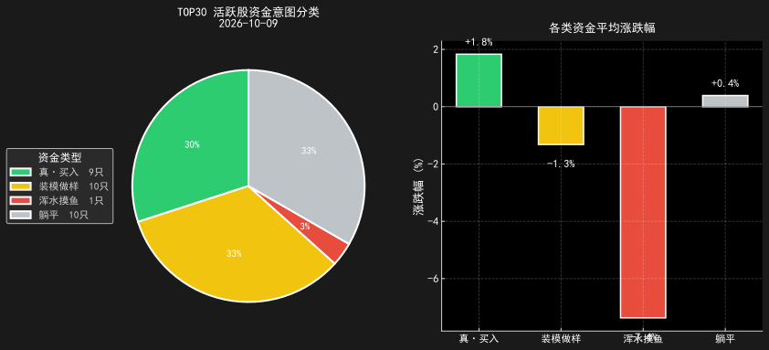
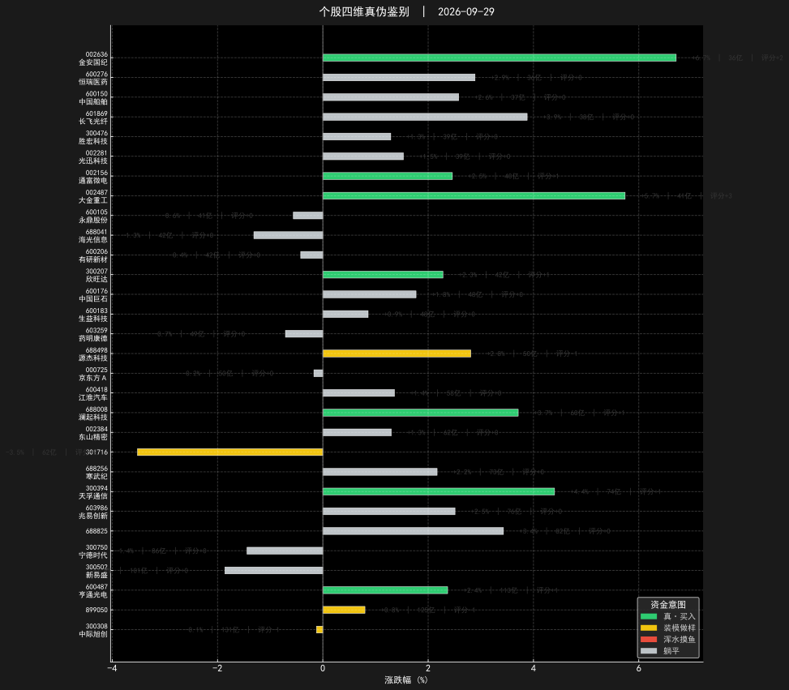
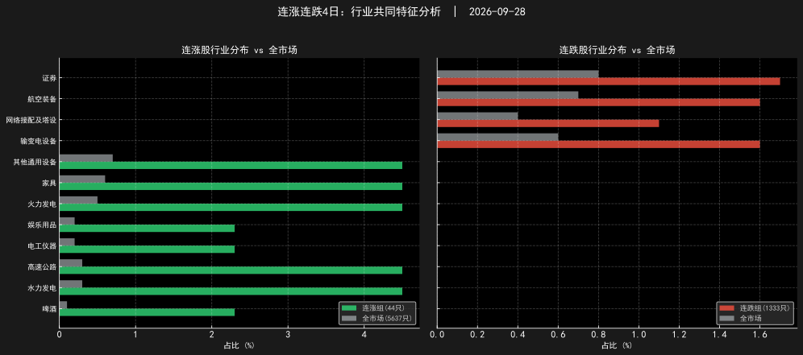

# TDX 综合分析报告 - 2026-09-28

数据日期: 2026-09-28

## 一、市场概览
全市场5,636只A股中，上涨858只、下跌4,662只。全市场平均涨跌幅-2.2%，中位数-1.9%。
强势股（涨超5%）80只，弱势股（跌超5%）799只。涨停11只，跌停72只。
总成交额17352亿元，头部10%个股占据59.0%成交额。
宽度变化：近2日上涨家数减少462.0只（前日1,839.0→当日1,377.0），弱势 (下跌占优)。

## 二、行业与概念热点
领涨: 电动乘用车(+2.7%)、林业(+2.5%)、黄酒(+2.5%) | 领跌: 镍(-9.1%)、光纤光缆(-7.8%)、网络接配及塔设(-7.0%)
热门概念: 猪肉(+1.2%)、分散染料(+0.6%)、鸡肉(+0.5%)

## 三、资金面分析
融资7313亿 | 龙虎榜机构今日买入10只

## 四、持续性与结构特征
连涨3日以上股票157只(占全市场2.8%)，其中主升浪级别(中及以上)74只（超强2只、强15只）。连跌3日以上331只。 连涨股减少271只 | 连跌股增加219只 | 主升浪减少140只 | 新出现连涨行业：仪器仪表、轨交设备、其他专用设备 | 消失的连涨行业：诊断试剂、疫苗、医疗研发外包 | 新出现连跌行业：半导体封测、水力发电
连涨股行业偏好：诊断服务(浓缩19.2倍)、家具(浓缩5.2倍)、仪器仪表(浓缩4.4倍)
连跌股集中在：黄金(浓缩13.0倍)、半导体设备(浓缩7.0倍)、半导体封测(浓缩6.6倍)

## 五、资本行为质量
成交额TOP30活跃股中，真实买入4只、装模做样7只、浑水摸鱼5只、躺平14只。
市场偏虚 — 活跃股中虚假信号占主导，警惕诱多/诱空陷阱

## 六、综合研判
但活跃股信号偏虚。明日预测看涨
结构性机会：连涨股集中于诊断服务等上游制造方向，回避黄金等下行行业。

