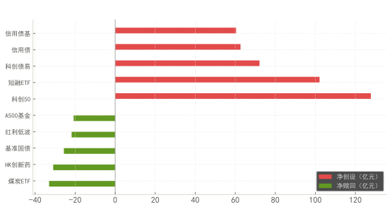
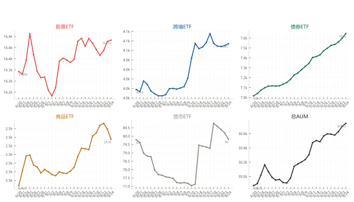
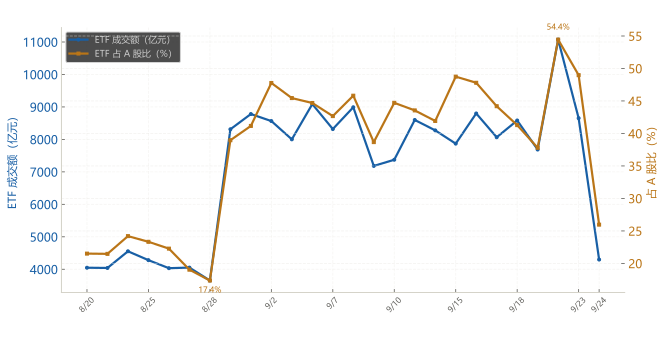
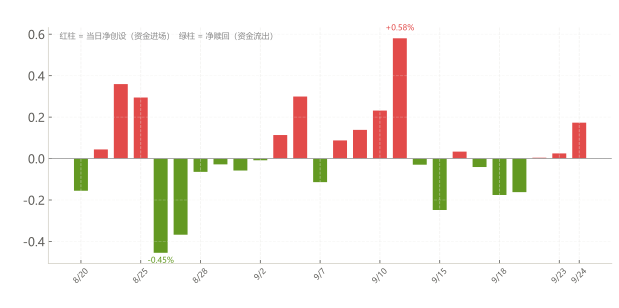

# ETF 申赎与成交额占比分析报告

数据期间：2026-08-20 00:00:00 → 2026-09-24 00:00:00（26 个交易日） · 覆盖 917 只 ETF · 数据来源：akshare

## 核心指标

| 指标 | 数值 |
|------|------|
| 覆盖 ETF 数 | 917 |
| 期间净申赎合计 | +992 亿 |
| 净创设 / 净赎回 | 359 只 / 449 只 |
| 当前日 ETF 占 A 股成交比 | 25.97% |
| ETF 总 AUM（期末） | 3.07 万亿 |

---

## 1. Top 5 净创设 vs 净赎回 ETF

| 净创设 Top5 | 金额 | 净赎回 Top5 | 金额 |
|-------------|------|-------------|------|
| 科创50 | +111 亿 | | |
| 科创债易 | +67 亿 | | |
| 公司债易 | +66 亿 | | |
| 信用债基 | +65 亿 | | |
| 信用债 | +63 亿 | | |
| | | HK创新药 | -50 亿 |
| | | 煤炭ETF | -42 亿 |
| | | 红利低波 | -27 亿 |
| | | 基准国债 | -27 亿 |
| | | 证券ETF | -24 亿 |

> 净创设与净赎回 Top5 轧差反映一级市场份额增减方向。

---

## 2. ETF 总 AUM 时序按类型拆分（份额 × 净值）—— 并列小图

| 类型 | 期初 AUM（亿） | 期末 AUM（亿） | 变动（亿） |
|------|---------------|---------------|-----------|
| 股票ETF | 16292 | 16433 | +141 |
| 跨境ETF | 4019 | 4067 | +48 |
| 债券ETF | 7017 | 7646 | +629 |
| 商品ETF | 2464 | 2518 | +54 |
| 货币ETF | 80 | 80 | +0 |

> 每个类型独立坐标，走势一目了然。股票 ETF 占总 AUM 的 54%。

---

## 3. ETF 成交额占 A 股比 —— 时序

| 指标 | 当前日数值 | 期间范围 |
|------|-----------|---------|
| ETF 成交额 | 4299 亿元 | 3653 ~ 11074 亿 |
| A 股成交额 | 16554 亿元 | 16143 ~ 21334 亿 |
| **ETF 占 A 股比** | **25.97%** | 17.36% ~ 54.45% |
| 期间均值 | **37.45%** | — |

> ETF 成交额 = 全市场 ETF 逐只成交额累加；A 股成交额 = 上交所 + 深交所股票成交金额合计。

---

## 4. ETF 每日净申赎率时序（Δ份额 / 前日总份额）

| 阶段 | 特征 |
|------|------|
| 期间峰值 | 9/11 触顶 +0.58% |
| 期间谷值 | 8/26 触底 -0.45% |
| 最新日 | 0.17%，26 个交易日中 13 天净赎回 |

> 红柱 = 当日净创设（资金进场），绿柱 = 净赎回（资金流出）。

---

## 5. 关键发现

1. **股票 ETF 是主体。** 706 只股票 ETF 占 ETF 总 AUM 的 54%，期间净赎回 268 亿，占全部净赎回的 63%。
2. **资金月间分歧。** 期间净申赎合计 +992 亿；较早月（2026-08）累计 -75 亿，最近月（2026-09）累计 +170 亿。
3. **资金在不同大类换仓。** 债券 ETF +629 亿、商品 ETF +54 亿，与股票 ETF 的 +268 亿形成对比。
4. **净创设前二。** 科创50 (+111亿)、科创债易 (+67亿) 是期间净创设主力。
5. **ETF 占 A 股成交比约两成。** 期间均值 37.5%，当前日 26.0%（ETF 4299 亿 / A 股 16554 亿）。

---

*报告生成时间：动态 · 数据来源：akshare · 脚本：fund_analysis/*
