# 📊 每日市场分析报告

**生成时间**: 2025-12-06 17:46:46  
**数据来源**: yfinance, akshare, 新浪财经  
**分析周期**: 3个月滚动窗口  
**执行状态**: ⚠️ 部分失败

---

## 🎯 执行摘要

- **总任务数**: 28
- **成功任务**: 23
- **警告数量**: 2
- **错误数量**: 3
- **生成图表**: 13 张
- **总耗时**: N/A

---

## 💡 核心市场洞察

### 流动性
融资12463亿 Shibor1.52% 🟢 宽松环境

---

## 📈 图表分析

### 🔷 全球核心指数

#### 标普500指数
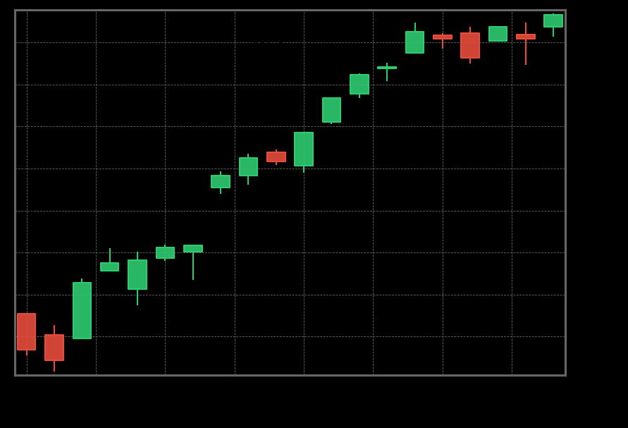

#### 纳斯达克100指数
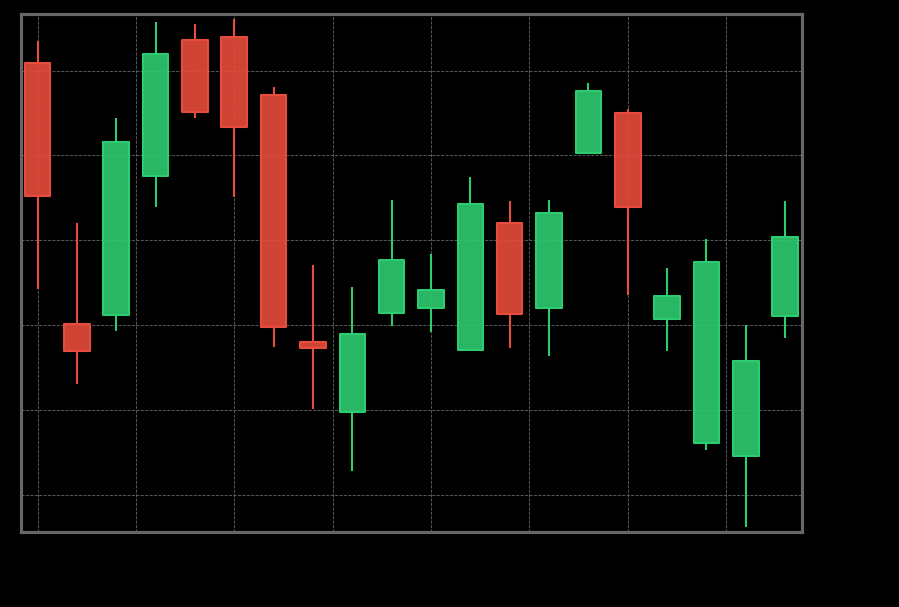

#### 罗素2000小盘股
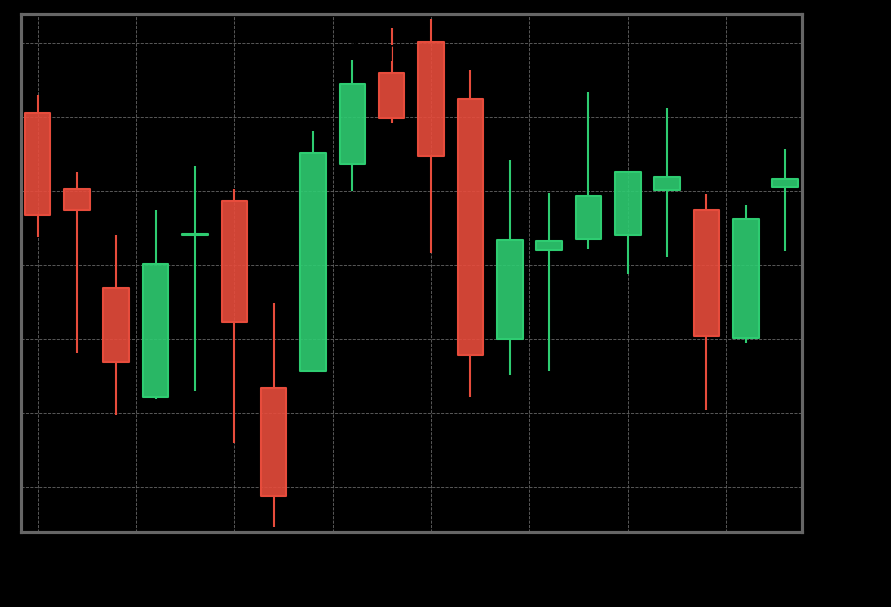

#### 恒生指数
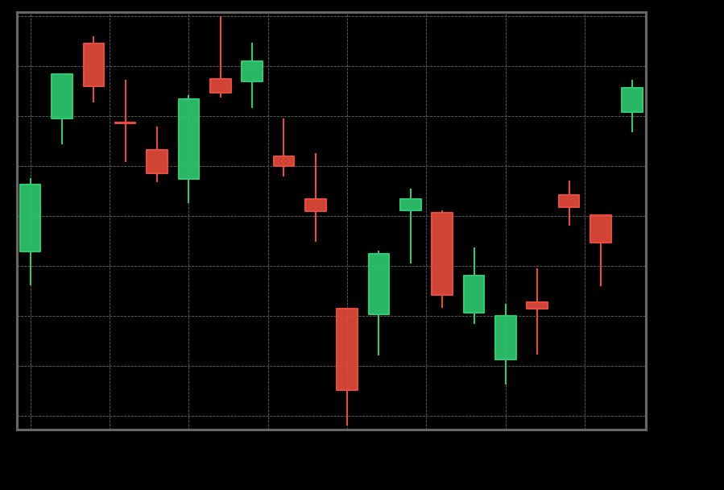

#### 人民币汇率
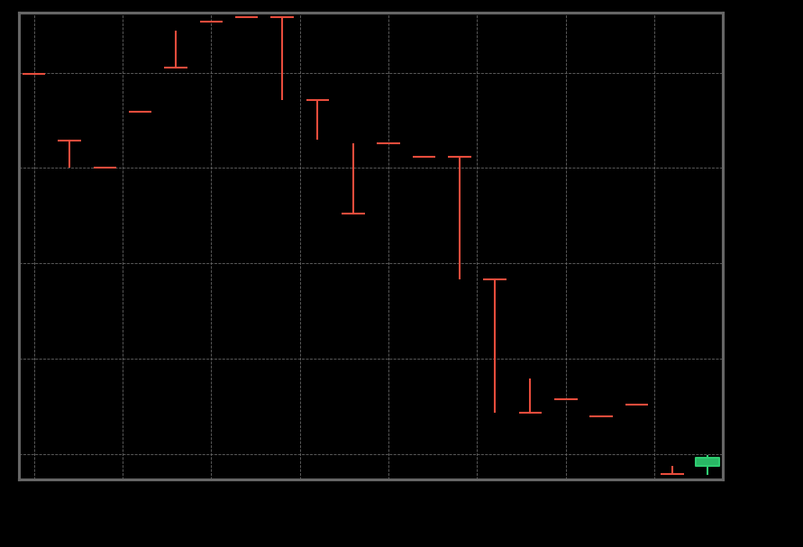

### 🔷 风险与利率指标

#### 美国10年期国债收益率
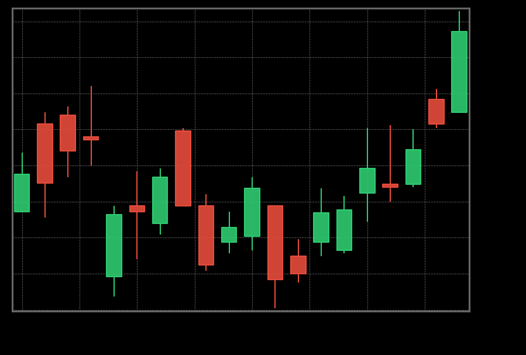

#### VIX恐慌指数
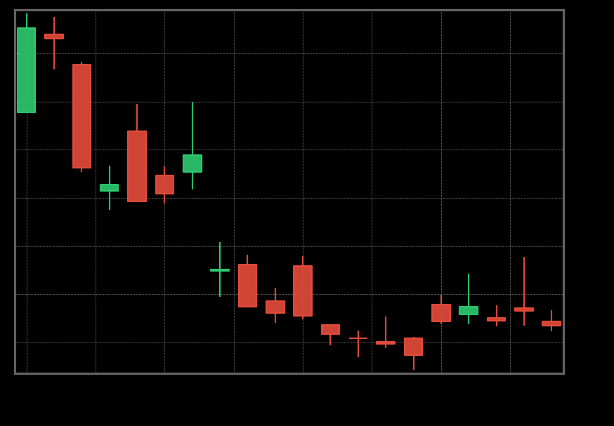

#### 油金比 vs 美债收益率
❌ 图表生成失败

### 🔷 中国市场流动性

#### 融资余额与10日均线
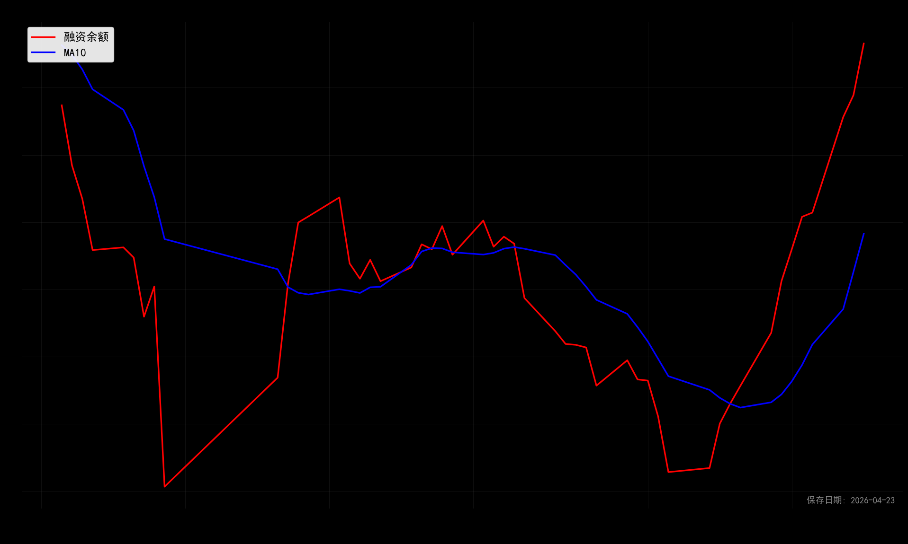

#### 多指标归一化对比
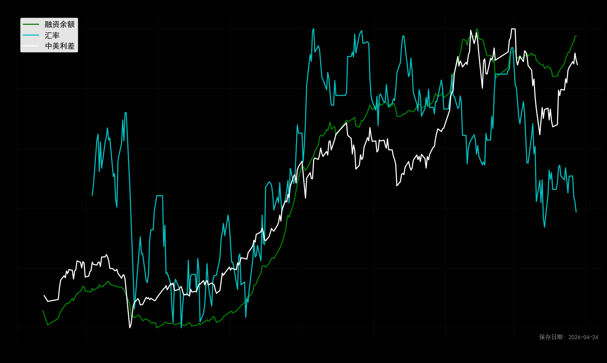

#### 融资余额与ETF对比
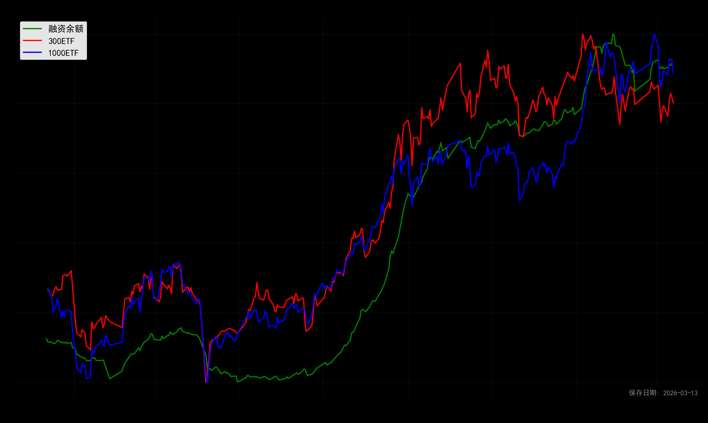

#### 流动性指标
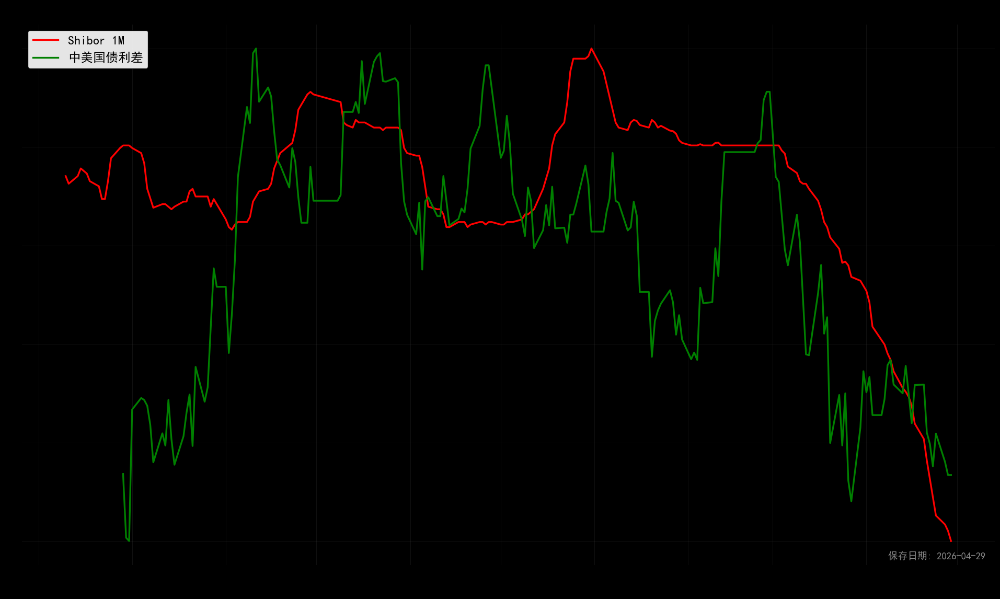

### 🔷 股债性价比分析
#### 上证50股债利差
❌ 图表生成失败

#### 恒生指数 vs Russell 2000
❌ 图表生成失败

---

## 💼 资产配置建议

### 股票/债券/现金配置比例
| 资产类别 | 建议比例 | 说明 |
|----------|----------|------|
| **股票** | 50% | 根据风险环境动态调整 |
| **债券** | 40% | 作为稳定器，对冲风险 |
| **现金** | 10% | 保持机动性 |

---

## ⚠️  风险警示

### 当前需重点关注的风险
- 日期交集不足
- fund_etf_hist_em: ('Connection aborted.', RemoteDisconnected('Remote end closed connection without response'))

---

*本报告由GitHub Actions自动生成于 2025-12-06 17:46*  
*版本: v1.0 | 算法更新: 2024-12*  
*免责声明: 报告仅供参考，不构成投资建议。*
