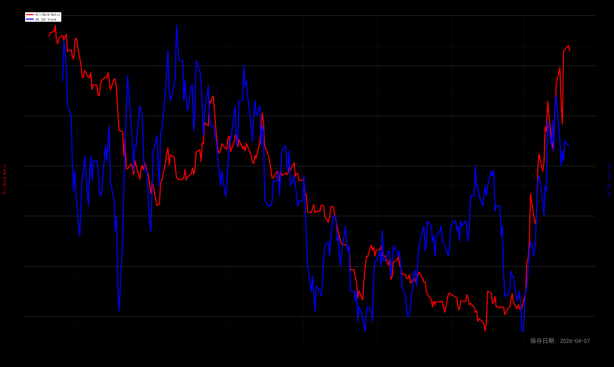
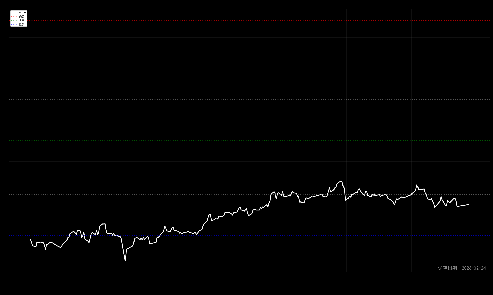
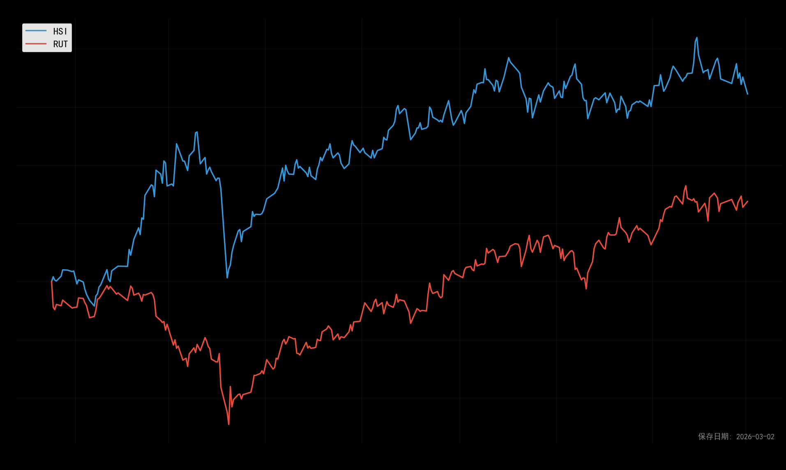
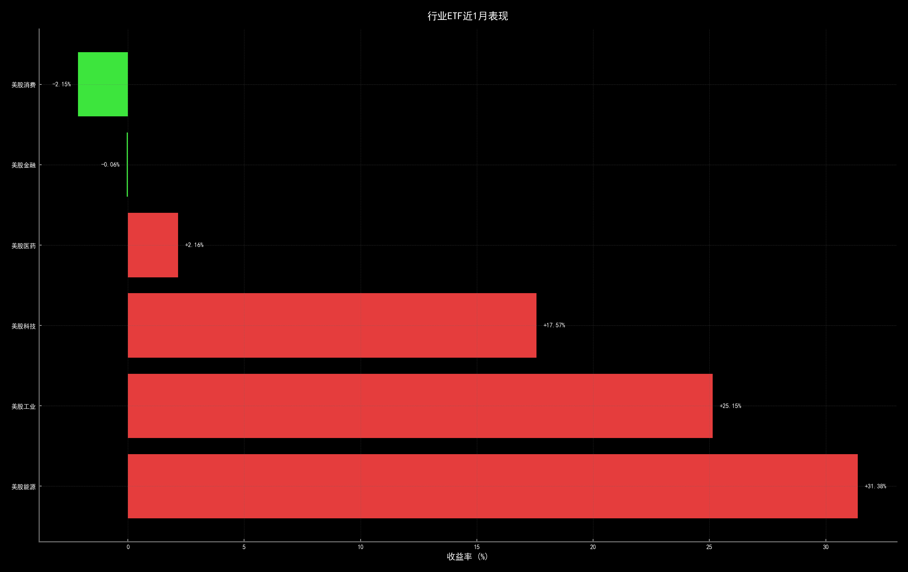

# 📊 每日市场分析报告

**生成时间**: 2025-12-08 15:32:12  
**数据来源**: yfinance, akshare, 新浪财经  
**分析周期**: 3个月滚动窗口  
**执行状态**: ⚠️ 部分失败

---

## 🎯 执行摘要

- **总任务数**: 30
- **成功任务**: 16
- **警告数量**: 1
- **错误数量**: 1
- **生成图表**: 5 张
- **总耗时**: 4.85秒

---

## 💡 核心市场洞察

### 1️⃣ 指数结构分析
纳指-0.28% 标普-0.25% 罗素+0.31% 价值风格

### 2️⃣ 风险环境评估
- VIX16.54 国债4.18% ⚪ 中等风险

### 3️⃣ 中美市场联动
- 恒指-2.53% 汇率-0.03% 🔓 弱联动

### 4️⃣ 流动性状况
- 数据暂缺

### 5️⃣ 股债性价比
- 🟢 股债利差处于历史低位，股票吸引力显著增强，债券相对昂贵

### 6️⃣ 行业轮动
- 行业轮动强度14.25% 美股科技, 美股金融

---

## 📋 详细市场分析报告

---

## 📈 图表分析

### 🔷 全球核心指数

#### 标普500指数

#### 纳斯达克100指数

#### 罗素2000小盘股

#### 恒生指数

#### 人民币汇率

### 🔷 风险与利率指标
#### 美国10年期国债收益率

#### VIX恐慌指数

#### 油金比 vs 美债收益率

### 🔷 中国市场流动性
#### 融资余额与10日均线

#### 多指标归一化对比

#### 流动性指标

### 🔷 股债性价比
#### 上证50股债利差

### 🔷 跨市场相关性
#### 恒生指数 vs Russell 2000

### 🔷 行业轮动
#### 近1月行业ETF表现

---
## 💼 资产配置建议

### 基于当前市场环境的配置

| 资产类别 | 建议比例 | 说明 |
|----------|----------|------|
| **股票** | 50% | 平衡配置，动态调整 |
| **债券** | 40% | 作为稳定器，对冲风险 |
| **现金** | 10% | 保持机动性 |
| **商品** | 0-10% | 根据通胀预期调整 |

### 区域配置建议
- **港股**: 标配
- **美股**: 超配价值股（周期风格主导）
- **A股**: 根据融资余额和流动性信号调整

### 重点关注板块
- 行业轮动强度14.25% 美股科技, 美股金融

---

## ⚠️ 风险警示

### 当前需重点关注的风险
- 暂无显著系统性风险

### 技术指标警示
- **股债利差**: 若跌破-7.8%，股票吸引力极低
- **VIX**: 若升至30以上，恐慌情绪蔓延
- **融资余额**: 若连续3天跌破MA10，资金撤离信号
- **中美利差**: 若持续走阔，资本外流压力加大

### 操作建议
1. **止损纪律**: 个股亏损超过8%坚决止损
2. **仓位管理**: 单只股票不超过总仓位20%
3. **再平衡**: 每月末根据配置比例再平衡
4. **动态调整**: 根据宏观信号每季度调整战略配置

---

## 📋 数据与方法论说明

### 数据来源
| 数据类型 | 来源 | 更新频率 |
|----------|------|----------|
| 美股/全球指数 | Yahoo Finance | 实时 |
| 中国宏观经济 | akshare | 每日 |
| 汇率/利率 | 新浪财经/央行 | 每日 |
| 融资余额 | 东方财富 | 每日 |

### 分析方法论
1. **多因子框架**: 结合估值、趋势、情绪、流动性四个维度
2. **相对价值**: 通过股债利差判断资产性价比
3. **风险平价**: 关注股债相关性变化
4. **行为金融**: 融资余额反映市场情绪

### 模型局限性
- 历史数据不代表未来表现
- 极端市场环境下模型可能失效
- 需结合基本面分析综合判断

---

*报告生成时间: {datetime.now().strftime('%Y-%m-%d %H:%M')}*  
*版本: v2.0 | 算法更新: 2024-12*  
*免责声明: 仅供参考，不构成投资建议。投资有风险，决策需谨慎。*
